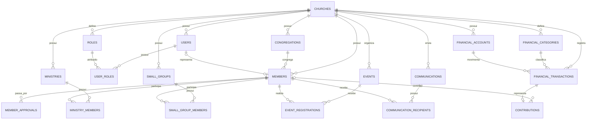

# Modelagem de Banco de Dados — SaaS de Gestão de Igrejas

## 1. Objetivos da modelagem

A modelagem deve atender inicialmente aos módulos do MVP:

1. Igrejas e congregações.
2. Usuários e controle de acesso.
3. Membros.
4. Autocadastro público com aprovação.
5. Células e ministérios.
6. Eventos e comunicação.
7. Financeiro e contribuições.
8. Auditoria e rastreabilidade.

A proposta considera:

* PostgreSQL como banco relacional.
* Arquitetura multi-tenant.
* Identificadores UUID.
* Exclusão lógica quando necessário.
* Tipagem forte no backend.
* Clean Architecture.
* Possibilidade de migração futura de infraestrutura.
* Compatibilidade com Python 3.12, SQLAlchemy e PostgreSQL.

---

# 2. Estratégia de multi-tenancy

Cada igreja será um tenant independente.

A entidade `churches` representa a organização principal. Quase todas as tabelas de negócio devem possuir uma coluna `church_id`.

Exemplo:

```text
churches
   ├── congregations
   ├── users
   ├── members
   ├── ministries
   ├── small_groups
   ├── events
   └── financial_transactions
```

## Regra principal

Um registro pertencente a uma igreja nunca pode ser acessado por outra igreja.

Essa restrição deve existir em três níveis:

1. Aplicação:

```python
repository.find_by_id(
    church_id=current_user.church_id,
    entity_id=member_id,
)
```

2. Banco de dados:

```sql
WHERE church_id = :current_church_id
```

3. Opcionalmente, Row-Level Security do PostgreSQL em uma evolução futura.

---

# 3. Convenções gerais

## Identificadores

Utilizar UUID:

```sql
id UUID PRIMARY KEY
```

Preferencialmente UUID v7, por possuir melhor ordenação temporal e comportamento de índice que UUID v4.

## Datas

Utilizar:

```sql
TIMESTAMP WITH TIME ZONE
```

No PostgreSQL:

```sql
TIMESTAMPTZ
```

As datas devem ser armazenadas em UTC e convertidas para o fuso da igreja na apresentação.

## Auditoria básica

As principais tabelas devem possuir:

```sql
created_at TIMESTAMPTZ NOT NULL
updated_at TIMESTAMPTZ NOT NULL
created_by UUID NULL
updated_by UUID NULL
```

## Exclusão lógica

Para entidades com relevância histórica:

```sql
deleted_at TIMESTAMPTZ NULL
```

Não utilizar exclusão lógica indiscriminadamente. Tabelas de relacionamento simples podem ser removidas fisicamente.

## Valores monetários

Valores financeiros devem ser armazenados em centavos:

```sql
amount_cents BIGINT NOT NULL
```

Exemplo:

```text
R$ 150,75 = 15075
```

Isso evita problemas de precisão com ponto flutuante.

Alternativamente, poderia ser utilizado:

```sql
NUMERIC(14,2)
```

Porém, armazenar centavos como inteiro costuma simplificar validações e cálculos no domínio.

---

# 4. Visão geral das entidades



---

# 5. Organização e multi-tenancy

## 5.1. Tabela `churches`

Representa uma igreja ou organização religiosa contratante.

```sql
CREATE TABLE churches (
    id UUID PRIMARY KEY,
    legal_name VARCHAR(200) NOT NULL,
    display_name VARCHAR(150) NOT NULL,
    slug VARCHAR(100) NOT NULL,
    document_number VARCHAR(20),
    email VARCHAR(254),
    phone VARCHAR(30),
    timezone VARCHAR(50) NOT NULL DEFAULT 'America/Sao_Paulo',
    status VARCHAR(30) NOT NULL DEFAULT 'active',
    created_at TIMESTAMPTZ NOT NULL,
    updated_at TIMESTAMPTZ NOT NULL,

    CONSTRAINT uq_churches_slug UNIQUE (slug),
    CONSTRAINT uq_churches_document UNIQUE (document_number),
    CONSTRAINT ck_churches_status CHECK (
        status IN ('active', 'suspended', 'cancelled')
    )
);
```

### Campos importantes

* `legal_name`: razão social ou nome institucional.
* `display_name`: nome público da igreja.
* `slug`: identificador usado em URLs públicas.

Exemplo:

```text
https://app.exemplo.com.br/cadastro/igreja-batista-central
```

* `document_number`: CNPJ, quando houver.
* `timezone`: fuso utilizado em eventos, notificações e relatórios.

---

## 5.2. Tabela `church_settings`

Armazena configurações que podem variar por igreja.

```sql
CREATE TABLE church_settings (
    id UUID PRIMARY KEY,
    church_id UUID NOT NULL,
    public_registration_enabled BOOLEAN NOT NULL DEFAULT TRUE,
    member_approval_required BOOLEAN NOT NULL DEFAULT TRUE,
    contribution_receipt_enabled BOOLEAN NOT NULL DEFAULT FALSE,
    default_currency CHAR(3) NOT NULL DEFAULT 'BRL',
    default_locale VARCHAR(10) NOT NULL DEFAULT 'pt-BR',
    created_at TIMESTAMPTZ NOT NULL,
    updated_at TIMESTAMPTZ NOT NULL,

    CONSTRAINT fk_church_settings_church
        FOREIGN KEY (church_id)
        REFERENCES churches(id),

    CONSTRAINT uq_church_settings_church UNIQUE (church_id)
);
```

Essa tabela evita espalhar configurações opcionais na tabela principal `churches`.

---

## 5.3. Tabela `congregations`

Representa templos, unidades ou congregações pertencentes à igreja.

```sql
CREATE TABLE congregations (
    id UUID PRIMARY KEY,
    church_id UUID NOT NULL,
    name VARCHAR(150) NOT NULL,
    code VARCHAR(50),
    email VARCHAR(254),
    phone VARCHAR(30),
    status VARCHAR(30) NOT NULL DEFAULT 'active',
    is_headquarters BOOLEAN NOT NULL DEFAULT FALSE,
    created_at TIMESTAMPTZ NOT NULL,
    updated_at TIMESTAMPTZ NOT NULL,
    deleted_at TIMESTAMPTZ,

    CONSTRAINT fk_congregations_church
        FOREIGN KEY (church_id)
        REFERENCES churches(id),

    CONSTRAINT uq_congregations_name
        UNIQUE (church_id, name),

    CONSTRAINT uq_congregations_code
        UNIQUE (church_id, code),

    CONSTRAINT ck_congregations_status CHECK (
        status IN ('active', 'inactive')
    )
);
```

Uma igreja pode possuir:

```text
Igreja Batista Central
├── Sede
├── Congregação Bairro Novo
└── Congregação Jardim Esperança
```

---

## 5.4. Tabela `addresses`

Endereços reutilizáveis.

```sql
CREATE TABLE addresses (
    id UUID PRIMARY KEY,
    church_id UUID NOT NULL,
    street VARCHAR(200) NOT NULL,
    number VARCHAR(30),
    complement VARCHAR(100),
    neighborhood VARCHAR(100),
    city VARCHAR(100) NOT NULL,
    state CHAR(2) NOT NULL,
    postal_code VARCHAR(10),
    country_code CHAR(2) NOT NULL DEFAULT 'BR',
    latitude NUMERIC(9,6),
    longitude NUMERIC(9,6),
    created_at TIMESTAMPTZ NOT NULL,
    updated_at TIMESTAMPTZ NOT NULL,

    CONSTRAINT fk_addresses_church
        FOREIGN KEY (church_id)
        REFERENCES churches(id)
);
```

Os relacionamentos podem ser feitos por:

```text
congregations.address_id
members.address_id
events.address_id
```

Para o MVP, essa abordagem é mais simples do que uma tabela polimórfica de endereços.

---

# 6. Usuários e autorização

## 6.1. Distinção entre usuário e membro

`users` representa quem acessa o sistema.

`members` representa uma pessoa cadastrada na igreja.

Um membro pode não possuir acesso ao sistema:

```text
Membro sem login:
members.user_id = NULL
```

Um membro com acesso ao portal:

```text
members.user_id = users.id
```

Administradores externos ou funcionários também podem possuir usuário sem necessariamente serem membros.

---

## 6.2. Tabela `users`

```sql
CREATE TABLE users (
    id UUID PRIMARY KEY,
    church_id UUID NOT NULL,
    email VARCHAR(254) NOT NULL,
    password_hash VARCHAR(255),
    display_name VARCHAR(150) NOT NULL,
    status VARCHAR(30) NOT NULL DEFAULT 'active',
    email_verified_at TIMESTAMPTZ,
    last_login_at TIMESTAMPTZ,
    created_at TIMESTAMPTZ NOT NULL,
    updated_at TIMESTAMPTZ NOT NULL,
    deleted_at TIMESTAMPTZ,

    CONSTRAINT fk_users_church
        FOREIGN KEY (church_id)
        REFERENCES churches(id),

    CONSTRAINT uq_users_email
        UNIQUE (church_id, email),

    CONSTRAINT ck_users_status CHECK (
        status IN ('pending', 'active', 'blocked', 'inactive')
    )
);
```

### Observação sobre e-mail

A unicidade é por igreja:

```sql
UNIQUE (church_id, email)
```

Isso permite que uma mesma pessoa tenha acesso a igrejas diferentes.

Entretanto, caso a autenticação seja centralizada e um usuário possa acessar múltiplas igrejas, uma modelagem mais evoluída seria:

```text
users
church_user_memberships
```

Para o MVP, um usuário vinculado diretamente à igreja é mais simples.

---

## 6.3. Tabela `roles`

```sql
CREATE TABLE roles (
    id UUID PRIMARY KEY,
    church_id UUID,
    name VARCHAR(100) NOT NULL,
    code VARCHAR(50) NOT NULL,
    description VARCHAR(500),
    is_system_role BOOLEAN NOT NULL DEFAULT FALSE,
    created_at TIMESTAMPTZ NOT NULL,
    updated_at TIMESTAMPTZ NOT NULL,

    CONSTRAINT fk_roles_church
        FOREIGN KEY (church_id)
        REFERENCES churches(id),

    CONSTRAINT uq_roles_code
        UNIQUE (church_id, code)
);
```

Papéis iniciais:

```text
super_admin
church_admin
pastor
secretary
treasurer
ministry_leader
small_group_leader
member
```

Papéis de sistema podem possuir `church_id = NULL`.

---

## 6.4. Tabela `permissions`

```sql
CREATE TABLE permissions (
    id UUID PRIMARY KEY,
    code VARCHAR(100) NOT NULL,
    description VARCHAR(500) NOT NULL,

    CONSTRAINT uq_permissions_code UNIQUE (code)
);
```

Exemplos:

```text
member:create
member:read
member:update
member:approve
member:delete

finance:read
finance:create
finance:update
finance:approve

event:create
event:update
event:publish

ministry:manage
small_group:manage
```

---

## 6.5. Tabela `role_permissions`

```sql
CREATE TABLE role_permissions (
    role_id UUID NOT NULL,
    permission_id UUID NOT NULL,

    PRIMARY KEY (role_id, permission_id),

    CONSTRAINT fk_role_permissions_role
        FOREIGN KEY (role_id)
        REFERENCES roles(id)
        ON DELETE CASCADE,

    CONSTRAINT fk_role_permissions_permission
        FOREIGN KEY (permission_id)
        REFERENCES permissions(id)
        ON DELETE CASCADE
);
```

---

## 6.6. Tabela `user_roles`

```sql
CREATE TABLE user_roles (
    user_id UUID NOT NULL,
    role_id UUID NOT NULL,
    congregation_id UUID,
    assigned_at TIMESTAMPTZ NOT NULL,
    assigned_by UUID,

    PRIMARY KEY (user_id, role_id, congregation_id),

    CONSTRAINT fk_user_roles_user
        FOREIGN KEY (user_id)
        REFERENCES users(id)
        ON DELETE CASCADE,

    CONSTRAINT fk_user_roles_role
        FOREIGN KEY (role_id)
        REFERENCES roles(id),

    CONSTRAINT fk_user_roles_congregation
        FOREIGN KEY (congregation_id)
        REFERENCES congregations(id),

    CONSTRAINT fk_user_roles_assigned_by
        FOREIGN KEY (assigned_by)
        REFERENCES users(id)
);
```

`congregation_id` permite limitar uma função a determinada congregação.

Exemplo:

```text
João:
- pastor na Congregação Bairro Novo
- líder de ministério na Sede
```

---

# 7. Cadastro de membros

## 7.1. Tabela `members`

```sql
CREATE TABLE members (
    id UUID PRIMARY KEY,
    church_id UUID NOT NULL,
    congregation_id UUID,
    user_id UUID,

    full_name VARCHAR(200) NOT NULL,
    preferred_name VARCHAR(100),
    email VARCHAR(254),
    phone VARCHAR(30),
    birth_date DATE,
    gender VARCHAR(30),

    document_number VARCHAR(20),
    marital_status VARCHAR(30),

    membership_status VARCHAR(30) NOT NULL DEFAULT 'pending',
    membership_type VARCHAR(30) NOT NULL DEFAULT 'member',

    joined_at DATE,
    baptized_at DATE,

    address_id UUID,

    photo_url VARCHAR(500),
    notes TEXT,

    registration_source VARCHAR(30) NOT NULL DEFAULT 'admin',
    consent_terms_at TIMESTAMPTZ,
    consent_image_at TIMESTAMPTZ,
    consent_privacy_at TIMESTAMPTZ,

    created_at TIMESTAMPTZ NOT NULL,
    updated_at TIMESTAMPTZ NOT NULL,
    created_by UUID,
    updated_by UUID,
    deleted_at TIMESTAMPTZ,

    CONSTRAINT fk_members_church
        FOREIGN KEY (church_id)
        REFERENCES churches(id),

    CONSTRAINT fk_members_congregation
        FOREIGN KEY (congregation_id)
        REFERENCES congregations(id),

    CONSTRAINT fk_members_user
        FOREIGN KEY (user_id)
        REFERENCES users(id),

    CONSTRAINT fk_members_address
        FOREIGN KEY (address_id)
        REFERENCES addresses(id),

    CONSTRAINT fk_members_created_by
        FOREIGN KEY (created_by)
        REFERENCES users(id),

    CONSTRAINT fk_members_updated_by
        FOREIGN KEY (updated_by)
        REFERENCES users(id),

    CONSTRAINT uq_members_user UNIQUE (user_id),

    CONSTRAINT ck_membership_status CHECK (
        membership_status IN (
            'pending',
            'active',
            'inactive',
            'transferred',
            'deceased',
            'rejected'
        )
    ),

    CONSTRAINT ck_membership_type CHECK (
        membership_type IN (
            'visitor',
            'attendee',
            'candidate',
            'member',
            'leader',
            'pastor'
        )
    ),

    CONSTRAINT ck_registration_source CHECK (
        registration_source IN (
            'admin',
            'public_form',
            'import',
            'integration'
        )
    )
);
```

---

## 7.2. Índices de membros

```sql
CREATE INDEX idx_members_church_status
    ON members (church_id, membership_status)
    WHERE deleted_at IS NULL;

CREATE INDEX idx_members_church_congregation
    ON members (church_id, congregation_id)
    WHERE deleted_at IS NULL;

CREATE INDEX idx_members_church_name
    ON members (church_id, full_name)
    WHERE deleted_at IS NULL;

CREATE INDEX idx_members_email
    ON members (church_id, email)
    WHERE email IS NOT NULL
      AND deleted_at IS NULL;

CREATE INDEX idx_members_phone
    ON members (church_id, phone)
    WHERE phone IS NOT NULL
      AND deleted_at IS NULL;
```

Para pesquisas por nome sem considerar acentos, pode ser utilizada a extensão `unaccent`:

```sql
CREATE EXTENSION IF NOT EXISTS unaccent;
```

---

# 8. Autocadastro e aprovação

O membro poderá acessar um link público:

```text
/cadastro/{church_slug}
```

O cadastro gera um membro com:

```text
membership_status = pending
registration_source = public_form
```

---

## 8.1. Tabela `member_approval_requests`

```sql
CREATE TABLE member_approval_requests (
    id UUID PRIMARY KEY,
    church_id UUID NOT NULL,
    member_id UUID NOT NULL,
    status VARCHAR(30) NOT NULL DEFAULT 'pending',
    submitted_at TIMESTAMPTZ NOT NULL,
    reviewed_at TIMESTAMPTZ,
    reviewed_by UUID,
    rejection_reason VARCHAR(1000),
    review_notes TEXT,
    created_at TIMESTAMPTZ NOT NULL,
    updated_at TIMESTAMPTZ NOT NULL,

    CONSTRAINT fk_member_approval_church
        FOREIGN KEY (church_id)
        REFERENCES churches(id),

    CONSTRAINT fk_member_approval_member
        FOREIGN KEY (member_id)
        REFERENCES members(id),

    CONSTRAINT fk_member_approval_reviewer
        FOREIGN KEY (reviewed_by)
        REFERENCES users(id),

    CONSTRAINT ck_member_approval_status CHECK (
        status IN ('pending', 'approved', 'rejected', 'cancelled')
    )
);
```

Não deve existir mais de uma solicitação pendente por membro:

```sql
CREATE UNIQUE INDEX uq_member_pending_approval
    ON member_approval_requests (member_id)
    WHERE status = 'pending';
```

---

## 8.2. Fluxo de aprovação

```text
1. Pessoa envia formulário público.
2. Sistema cria members com status pending.
3. Sistema cria member_approval_requests.
4. Pastor, administrador ou secretário revisa.
5. Em caso de aprovação:
   - approval_request.status = approved
   - members.membership_status = active
6. Em caso de rejeição:
   - approval_request.status = rejected
   - members.membership_status = rejected
```

A atualização deve acontecer dentro da mesma transação.

---

## 8.3. Histórico de status do membro

```sql
CREATE TABLE member_status_history (
    id UUID PRIMARY KEY,
    church_id UUID NOT NULL,
    member_id UUID NOT NULL,
    previous_status VARCHAR(30),
    new_status VARCHAR(30) NOT NULL,
    reason VARCHAR(1000),
    changed_by UUID,
    changed_at TIMESTAMPTZ NOT NULL,

    CONSTRAINT fk_member_status_history_church
        FOREIGN KEY (church_id)
        REFERENCES churches(id),

    CONSTRAINT fk_member_status_history_member
        FOREIGN KEY (member_id)
        REFERENCES members(id),

    CONSTRAINT fk_member_status_history_user
        FOREIGN KEY (changed_by)
        REFERENCES users(id)
);
```

Esse histórico é importante para auditoria e relatórios.

---

# 9. Contatos de emergência e família

## 9.1. Tabela `member_emergency_contacts`

```sql
CREATE TABLE member_emergency_contacts (
    id UUID PRIMARY KEY,
    church_id UUID NOT NULL,
    member_id UUID NOT NULL,
    name VARCHAR(150) NOT NULL,
    relationship VARCHAR(100),
    phone VARCHAR(30) NOT NULL,
    is_primary BOOLEAN NOT NULL DEFAULT FALSE,
    created_at TIMESTAMPTZ NOT NULL,
    updated_at TIMESTAMPTZ NOT NULL,

    CONSTRAINT fk_emergency_contact_church
        FOREIGN KEY (church_id)
        REFERENCES churches(id),

    CONSTRAINT fk_emergency_contact_member
        FOREIGN KEY (member_id)
        REFERENCES members(id)
        ON DELETE CASCADE
);
```

---

## 9.2. Tabela `member_relationships`

Relaciona membros da mesma família.

```sql
CREATE TABLE member_relationships (
    id UUID PRIMARY KEY,
    church_id UUID NOT NULL,
    member_id UUID NOT NULL,
    related_member_id UUID NOT NULL,
    relationship_type VARCHAR(30) NOT NULL,
    created_at TIMESTAMPTZ NOT NULL,

    CONSTRAINT fk_member_relationships_church
        FOREIGN KEY (church_id)
        REFERENCES churches(id),

    CONSTRAINT fk_member_relationships_member
        FOREIGN KEY (member_id)
        REFERENCES members(id),

    CONSTRAINT fk_member_relationships_related
        FOREIGN KEY (related_member_id)
        REFERENCES members(id),

    CONSTRAINT uq_member_relationship
        UNIQUE (member_id, related_member_id, relationship_type),

    CONSTRAINT ck_relationship_not_self
        CHECK (member_id <> related_member_id),

    CONSTRAINT ck_relationship_type CHECK (
        relationship_type IN (
            'spouse',
            'parent',
            'child',
            'sibling',
            'guardian',
            'dependent',
            'other'
        )
    )
);
```

As relações são direcionais.

Exemplo:

```text
João -> Maria: spouse
Maria -> João: spouse
João -> Pedro: parent
Pedro -> João: child
```

A aplicação deve criar os dois lados dentro da mesma transação quando necessário.

---

# 10. Ministérios

## 10.1. Tabela `ministries`

```sql
CREATE TABLE ministries (
    id UUID PRIMARY KEY,
    church_id UUID NOT NULL,
    congregation_id UUID,
    name VARCHAR(150) NOT NULL,
    description TEXT,
    status VARCHAR(30) NOT NULL DEFAULT 'active',
    leader_member_id UUID,
    created_at TIMESTAMPTZ NOT NULL,
    updated_at TIMESTAMPTZ NOT NULL,
    deleted_at TIMESTAMPTZ,

    CONSTRAINT fk_ministries_church
        FOREIGN KEY (church_id)
        REFERENCES churches(id),

    CONSTRAINT fk_ministries_congregation
        FOREIGN KEY (congregation_id)
        REFERENCES congregations(id),

    CONSTRAINT fk_ministries_leader
        FOREIGN KEY (leader_member_id)
        REFERENCES members(id),

    CONSTRAINT uq_ministries_name
        UNIQUE (church_id, congregation_id, name),

    CONSTRAINT ck_ministries_status CHECK (
        status IN ('active', 'inactive')
    )
);
```

---

## 10.2. Tabela `ministry_members`

```sql
CREATE TABLE ministry_members (
    id UUID PRIMARY KEY,
    church_id UUID NOT NULL,
    ministry_id UUID NOT NULL,
    member_id UUID NOT NULL,
    role VARCHAR(50) NOT NULL DEFAULT 'participant',
    status VARCHAR(30) NOT NULL DEFAULT 'active',
    joined_at DATE NOT NULL,
    left_at DATE,
    created_at TIMESTAMPTZ NOT NULL,
    updated_at TIMESTAMPTZ NOT NULL,

    CONSTRAINT fk_ministry_members_church
        FOREIGN KEY (church_id)
        REFERENCES churches(id),

    CONSTRAINT fk_ministry_members_ministry
        FOREIGN KEY (ministry_id)
        REFERENCES ministries(id),

    CONSTRAINT fk_ministry_members_member
        FOREIGN KEY (member_id)
        REFERENCES members(id),

    CONSTRAINT uq_ministry_member
        UNIQUE (ministry_id, member_id),

    CONSTRAINT ck_ministry_member_role CHECK (
        role IN (
            'leader',
            'coordinator',
            'assistant',
            'participant'
        )
    ),

    CONSTRAINT ck_ministry_member_status CHECK (
        status IN ('active', 'inactive')
    )
);
```

---

# 11. Células e pequenos grupos

## 11.1. Tabela `small_groups`

```sql
CREATE TABLE small_groups (
    id UUID PRIMARY KEY,
    church_id UUID NOT NULL,
    congregation_id UUID,
    name VARCHAR(150) NOT NULL,
    description TEXT,
    group_type VARCHAR(30) NOT NULL DEFAULT 'cell',
    status VARCHAR(30) NOT NULL DEFAULT 'active',

    leader_member_id UUID,
    co_leader_member_id UUID,

    meeting_weekday SMALLINT,
    meeting_time TIME,
    meeting_frequency VARCHAR(30) NOT NULL DEFAULT 'weekly',

    address_id UUID,
    max_members INTEGER,

    created_at TIMESTAMPTZ NOT NULL,
    updated_at TIMESTAMPTZ NOT NULL,
    deleted_at TIMESTAMPTZ,

    CONSTRAINT fk_small_groups_church
        FOREIGN KEY (church_id)
        REFERENCES churches(id),

    CONSTRAINT fk_small_groups_congregation
        FOREIGN KEY (congregation_id)
        REFERENCES congregations(id),

    CONSTRAINT fk_small_groups_leader
        FOREIGN KEY (leader_member_id)
        REFERENCES members(id),

    CONSTRAINT fk_small_groups_co_leader
        FOREIGN KEY (co_leader_member_id)
        REFERENCES members(id),

    CONSTRAINT fk_small_groups_address
        FOREIGN KEY (address_id)
        REFERENCES addresses(id),

    CONSTRAINT uq_small_groups_name
        UNIQUE (church_id, congregation_id, name),

    CONSTRAINT ck_small_groups_weekday CHECK (
        meeting_weekday BETWEEN 0 AND 6
    ),

    CONSTRAINT ck_small_groups_type CHECK (
        group_type IN (
            'cell',
            'small_group',
            'discipleship',
            'study_group',
            'prayer_group'
        )
    ),

    CONSTRAINT ck_small_groups_frequency CHECK (
        meeting_frequency IN (
            'weekly',
            'biweekly',
            'monthly',
            'custom'
        )
    ),

    CONSTRAINT ck_small_groups_status CHECK (
        status IN ('active', 'inactive', 'closed')
    )
);
```

Convenção para `meeting_weekday`:

```text
0 = domingo
1 = segunda-feira
2 = terça-feira
3 = quarta-feira
4 = quinta-feira
5 = sexta-feira
6 = sábado
```

---

## 11.2. Tabela `small_group_members`

```sql
CREATE TABLE small_group_members (
    id UUID PRIMARY KEY,
    church_id UUID NOT NULL,
    small_group_id UUID NOT NULL,
    member_id UUID NOT NULL,
    role VARCHAR(30) NOT NULL DEFAULT 'participant',
    status VARCHAR(30) NOT NULL DEFAULT 'active',
    joined_at DATE NOT NULL,
    left_at DATE,
    created_at TIMESTAMPTZ NOT NULL,
    updated_at TIMESTAMPTZ NOT NULL,

    CONSTRAINT fk_small_group_members_church
        FOREIGN KEY (church_id)
        REFERENCES churches(id),

    CONSTRAINT fk_small_group_members_group
        FOREIGN KEY (small_group_id)
        REFERENCES small_groups(id),

    CONSTRAINT fk_small_group_members_member
        FOREIGN KEY (member_id)
        REFERENCES members(id),

    CONSTRAINT uq_small_group_member
        UNIQUE (small_group_id, member_id),

    CONSTRAINT ck_small_group_member_role CHECK (
        role IN ('leader', 'co_leader', 'host', 'participant')
    ),

    CONSTRAINT ck_small_group_member_status CHECK (
        status IN ('active', 'inactive')
    )
);
```

---

## 11.3. Encontros das células

```sql
CREATE TABLE small_group_meetings (
    id UUID PRIMARY KEY,
    church_id UUID NOT NULL,
    small_group_id UUID NOT NULL,
    scheduled_at TIMESTAMPTZ NOT NULL,
    started_at TIMESTAMPTZ,
    finished_at TIMESTAMPTZ,
    status VARCHAR(30) NOT NULL DEFAULT 'scheduled',
    theme VARCHAR(200),
    notes TEXT,
    created_at TIMESTAMPTZ NOT NULL,
    updated_at TIMESTAMPTZ NOT NULL,

    CONSTRAINT fk_group_meetings_church
        FOREIGN KEY (church_id)
        REFERENCES churches(id),

    CONSTRAINT fk_group_meetings_group
        FOREIGN KEY (small_group_id)
        REFERENCES small_groups(id),

    CONSTRAINT ck_group_meetings_status CHECK (
        status IN (
            'scheduled',
            'completed',
            'cancelled'
        )
    )
);
```

---

## 11.4. Presença nas células

```sql
CREATE TABLE small_group_attendances (
    meeting_id UUID NOT NULL,
    member_id UUID NOT NULL,
    attendance_status VARCHAR(30) NOT NULL,
    checked_at TIMESTAMPTZ,
    notes VARCHAR(500),

    PRIMARY KEY (meeting_id, member_id),

    CONSTRAINT fk_group_attendance_meeting
        FOREIGN KEY (meeting_id)
        REFERENCES small_group_meetings(id)
        ON DELETE CASCADE,

    CONSTRAINT fk_group_attendance_member
        FOREIGN KEY (member_id)
        REFERENCES members(id),

    CONSTRAINT ck_group_attendance_status CHECK (
        attendance_status IN (
            'present',
            'absent',
            'justified',
            'visitor'
        )
    )
);
```

---

# 12. Eventos

## 12.1. Tabela `events`

```sql
CREATE TABLE events (
    id UUID PRIMARY KEY,
    church_id UUID NOT NULL,
    congregation_id UUID,
    ministry_id UUID,

    title VARCHAR(200) NOT NULL,
    description TEXT,
    event_type VARCHAR(50) NOT NULL,

    status VARCHAR(30) NOT NULL DEFAULT 'draft',
    visibility VARCHAR(30) NOT NULL DEFAULT 'members',

    starts_at TIMESTAMPTZ NOT NULL,
    ends_at TIMESTAMPTZ,

    location_type VARCHAR(30) NOT NULL DEFAULT 'physical',
    address_id UUID,
    online_url VARCHAR(500),

    capacity INTEGER,
    registration_required BOOLEAN NOT NULL DEFAULT FALSE,
    registration_deadline TIMESTAMPTZ,

    created_by UUID NOT NULL,
    published_at TIMESTAMPTZ,
    created_at TIMESTAMPTZ NOT NULL,
    updated_at TIMESTAMPTZ NOT NULL,
    deleted_at TIMESTAMPTZ,

    CONSTRAINT fk_events_church
        FOREIGN KEY (church_id)
        REFERENCES churches(id),

    CONSTRAINT fk_events_congregation
        FOREIGN KEY (congregation_id)
        REFERENCES congregations(id),

    CONSTRAINT fk_events_ministry
        FOREIGN KEY (ministry_id)
        REFERENCES ministries(id),

    CONSTRAINT fk_events_address
        FOREIGN KEY (address_id)
        REFERENCES addresses(id),

    CONSTRAINT fk_events_created_by
        FOREIGN KEY (created_by)
        REFERENCES users(id),

    CONSTRAINT ck_events_status CHECK (
        status IN (
            'draft',
            'published',
            'cancelled',
            'completed'
        )
    ),

    CONSTRAINT ck_events_visibility CHECK (
        visibility IN (
            'public',
            'members',
            'leaders',
            'private'
        )
    ),

    CONSTRAINT ck_events_location_type CHECK (
        location_type IN (
            'physical',
            'online',
            'hybrid'
        )
    ),

    CONSTRAINT ck_events_dates CHECK (
        ends_at IS NULL OR ends_at >= starts_at
    )
);
```

---

## 12.2. Tabela `event_registrations`

```sql
CREATE TABLE event_registrations (
    id UUID PRIMARY KEY,
    church_id UUID NOT NULL,
    event_id UUID NOT NULL,
    member_id UUID,
    guest_name VARCHAR(200),
    guest_email VARCHAR(254),
    guest_phone VARCHAR(30),

    status VARCHAR(30) NOT NULL DEFAULT 'confirmed',
    registered_at TIMESTAMPTZ NOT NULL,
    cancelled_at TIMESTAMPTZ,
    checked_in_at TIMESTAMPTZ,

    created_at TIMESTAMPTZ NOT NULL,
    updated_at TIMESTAMPTZ NOT NULL,

    CONSTRAINT fk_event_registration_church
        FOREIGN KEY (church_id)
        REFERENCES churches(id),

    CONSTRAINT fk_event_registration_event
        FOREIGN KEY (event_id)
        REFERENCES events(id),

    CONSTRAINT fk_event_registration_member
        FOREIGN KEY (member_id)
        REFERENCES members(id),

    CONSTRAINT ck_event_registration_person CHECK (
        member_id IS NOT NULL OR guest_name IS NOT NULL
    ),

    CONSTRAINT ck_event_registration_status CHECK (
        status IN (
            'pending',
            'confirmed',
            'waitlisted',
            'cancelled',
            'attended',
            'no_show'
        )
    )
);
```

Impedir inscrição duplicada de um membro:

```sql
CREATE UNIQUE INDEX uq_event_member_registration
    ON event_registrations (event_id, member_id)
    WHERE member_id IS NOT NULL
      AND status <> 'cancelled';
```

---

# 13. Comunicação

## 13.1. Tabela `communications`

Representa um comunicado ou campanha.

```sql
CREATE TABLE communications (
    id UUID PRIMARY KEY,
    church_id UUID NOT NULL,
    congregation_id UUID,

    title VARCHAR(200) NOT NULL,
    content TEXT NOT NULL,

    channel VARCHAR(30) NOT NULL,
    status VARCHAR(30) NOT NULL DEFAULT 'draft',

    target_type VARCHAR(30) NOT NULL,
    target_reference_id UUID,

    scheduled_at TIMESTAMPTZ,
    sent_at TIMESTAMPTZ,

    created_by UUID NOT NULL,
    created_at TIMESTAMPTZ NOT NULL,
    updated_at TIMESTAMPTZ NOT NULL,

    CONSTRAINT fk_communications_church
        FOREIGN KEY (church_id)
        REFERENCES churches(id),

    CONSTRAINT fk_communications_congregation
        FOREIGN KEY (congregation_id)
        REFERENCES congregations(id),

    CONSTRAINT fk_communications_created_by
        FOREIGN KEY (created_by)
        REFERENCES users(id),

    CONSTRAINT ck_communications_channel CHECK (
        channel IN (
            'email',
            'sms',
            'whatsapp',
            'push',
            'internal'
        )
    ),

    CONSTRAINT ck_communications_status CHECK (
        status IN (
            'draft',
            'scheduled',
            'processing',
            'sent',
            'partially_sent',
            'failed',
            'cancelled'
        )
    ),

    CONSTRAINT ck_communications_target CHECK (
        target_type IN (
            'all_members',
            'congregation',
            'ministry',
            'small_group',
            'custom'
        )
    )
);
```

`target_reference_id` pode identificar a congregação, ministério ou célula.

Essa associação polimórfica deve ser validada pela aplicação. Como alternativa mais rígida, poderiam ser usadas colunas específicas:

```text
target_congregation_id
target_ministry_id
target_small_group_id
```

Para o MVP, colunas específicas são mais seguras. Uma versão recomendada seria:

```sql
target_congregation_id UUID,
target_ministry_id UUID,
target_small_group_id UUID
```

e uma restrição garantindo que somente uma delas esteja preenchida.

---

## 13.2. Tabela `communication_recipients`

Materializa os destinatários no momento do envio.

```sql
CREATE TABLE communication_recipients (
    id UUID PRIMARY KEY,
    church_id UUID NOT NULL,
    communication_id UUID NOT NULL,
    member_id UUID,
    destination VARCHAR(254) NOT NULL,
    status VARCHAR(30) NOT NULL DEFAULT 'pending',

    provider_message_id VARCHAR(255),
    failure_reason TEXT,

    sent_at TIMESTAMPTZ,
    delivered_at TIMESTAMPTZ,
    read_at TIMESTAMPTZ,

    created_at TIMESTAMPTZ NOT NULL,
    updated_at TIMESTAMPTZ NOT NULL,

    CONSTRAINT fk_communication_recipient_church
        FOREIGN KEY (church_id)
        REFERENCES churches(id),

    CONSTRAINT fk_communication_recipient_communication
        FOREIGN KEY (communication_id)
        REFERENCES communications(id),

    CONSTRAINT fk_communication_recipient_member
        FOREIGN KEY (member_id)
        REFERENCES members(id),

    CONSTRAINT ck_communication_recipient_status CHECK (
        status IN (
            'pending',
            'processing',
            'sent',
            'delivered',
            'read',
            'failed',
            'cancelled'
        )
    )
);
```

É importante registrar o destino, mesmo quando o membro posteriormente altera seu e-mail ou telefone.

---

# 14. Financeiro

## 14.1. Princípios

O módulo financeiro deve separar:

* Conta financeira.
* Categoria.
* Lançamento.
* Contribuição.
* Forma de pagamento.
* Competência e data de pagamento.
* Receitas e despesas.
* Status financeiro.
* Responsável pelo registro.

---

## 14.2. Tabela `financial_accounts`

Representa caixa, banco ou carteira.

```sql
CREATE TABLE financial_accounts (
    id UUID PRIMARY KEY,
    church_id UUID NOT NULL,
    congregation_id UUID,

    name VARCHAR(150) NOT NULL,
    account_type VARCHAR(30) NOT NULL,
    institution_name VARCHAR(150),
    initial_balance_cents BIGINT NOT NULL DEFAULT 0,
    status VARCHAR(30) NOT NULL DEFAULT 'active',

    created_at TIMESTAMPTZ NOT NULL,
    updated_at TIMESTAMPTZ NOT NULL,
    deleted_at TIMESTAMPTZ,

    CONSTRAINT fk_financial_accounts_church
        FOREIGN KEY (church_id)
        REFERENCES churches(id),

    CONSTRAINT fk_financial_accounts_congregation
        FOREIGN KEY (congregation_id)
        REFERENCES congregations(id),

    CONSTRAINT uq_financial_accounts_name
        UNIQUE (church_id, congregation_id, name),

    CONSTRAINT ck_financial_account_type CHECK (
        account_type IN (
            'cash',
            'checking',
            'savings',
            'digital_wallet',
            'investment'
        )
    ),

    CONSTRAINT ck_financial_account_status CHECK (
        status IN ('active', 'inactive', 'closed')
    )
);
```

---

## 14.3. Tabela `financial_categories`

```sql
CREATE TABLE financial_categories (
    id UUID PRIMARY KEY,
    church_id UUID NOT NULL,
    parent_id UUID,

    name VARCHAR(150) NOT NULL,
    category_type VARCHAR(20) NOT NULL,
    code VARCHAR(50),
    status VARCHAR(30) NOT NULL DEFAULT 'active',

    created_at TIMESTAMPTZ NOT NULL,
    updated_at TIMESTAMPTZ NOT NULL,

    CONSTRAINT fk_financial_categories_church
        FOREIGN KEY (church_id)
        REFERENCES churches(id),

    CONSTRAINT fk_financial_categories_parent
        FOREIGN KEY (parent_id)
        REFERENCES financial_categories(id),

    CONSTRAINT uq_financial_categories_name
        UNIQUE (church_id, parent_id, name),

    CONSTRAINT ck_financial_category_type CHECK (
        category_type IN ('income', 'expense')
    ),

    CONSTRAINT ck_financial_category_status CHECK (
        status IN ('active', 'inactive')
    )
);
```

Exemplo:

```text
Receitas
├── Dízimos
├── Ofertas
├── Missões
└── Eventos

Despesas
├── Água
├── Energia
├── Aluguel
├── Manutenção
└── Ação social
```

---

## 14.4. Tabela `financial_transactions`

```sql
CREATE TABLE financial_transactions (
    id UUID PRIMARY KEY,
    church_id UUID NOT NULL,
    congregation_id UUID,
    account_id UUID NOT NULL,
    category_id UUID NOT NULL,

    transaction_type VARCHAR(20) NOT NULL,
    description VARCHAR(500) NOT NULL,

    amount_cents BIGINT NOT NULL,
    currency CHAR(3) NOT NULL DEFAULT 'BRL',

    occurred_on DATE NOT NULL,
    due_on DATE,
    paid_on DATE,
    competence_month DATE,

    status VARCHAR(30) NOT NULL DEFAULT 'pending',
    payment_method VARCHAR(30),

    external_reference VARCHAR(255),
    notes TEXT,

    created_by UUID NOT NULL,
    approved_by UUID,
    approved_at TIMESTAMPTZ,

    created_at TIMESTAMPTZ NOT NULL,
    updated_at TIMESTAMPTZ NOT NULL,
    deleted_at TIMESTAMPTZ,

    CONSTRAINT fk_financial_transactions_church
        FOREIGN KEY (church_id)
        REFERENCES churches(id),

    CONSTRAINT fk_financial_transactions_congregation
        FOREIGN KEY (congregation_id)
        REFERENCES congregations(id),

    CONSTRAINT fk_financial_transactions_account
        FOREIGN KEY (account_id)
        REFERENCES financial_accounts(id),

    CONSTRAINT fk_financial_transactions_category
        FOREIGN KEY (category_id)
        REFERENCES financial_categories(id),

    CONSTRAINT fk_financial_transactions_created_by
        FOREIGN KEY (created_by)
        REFERENCES users(id),

    CONSTRAINT fk_financial_transactions_approved_by
        FOREIGN KEY (approved_by)
        REFERENCES users(id),

    CONSTRAINT ck_financial_transaction_amount CHECK (
        amount_cents > 0
    ),

    CONSTRAINT ck_financial_transaction_type CHECK (
        transaction_type IN ('income', 'expense', 'transfer')
    ),

    CONSTRAINT ck_financial_transaction_status CHECK (
        status IN (
            'pending',
            'confirmed',
            'paid',
            'cancelled',
            'reversed'
        )
    ),

    CONSTRAINT ck_financial_payment_method CHECK (
        payment_method IS NULL OR payment_method IN (
            'cash',
            'pix',
            'credit_card',
            'debit_card',
            'bank_transfer',
            'bank_slip',
            'check',
            'other'
        )
    )
);
```

---

## 14.5. Tabela `contributions`

Representa dízimos, ofertas e outras contribuições.

```sql
CREATE TABLE contributions (
    id UUID PRIMARY KEY,
    church_id UUID NOT NULL,
    transaction_id UUID NOT NULL,
    member_id UUID,

    contribution_type VARCHAR(30) NOT NULL,
    is_anonymous BOOLEAN NOT NULL DEFAULT FALSE,
    receipt_requested BOOLEAN NOT NULL DEFAULT FALSE,

    created_at TIMESTAMPTZ NOT NULL,
    updated_at TIMESTAMPTZ NOT NULL,

    CONSTRAINT fk_contributions_church
        FOREIGN KEY (church_id)
        REFERENCES churches(id),

    CONSTRAINT fk_contributions_transaction
        FOREIGN KEY (transaction_id)
        REFERENCES financial_transactions(id),

    CONSTRAINT fk_contributions_member
        FOREIGN KEY (member_id)
        REFERENCES members(id),

    CONSTRAINT uq_contributions_transaction
        UNIQUE (transaction_id),

    CONSTRAINT ck_contribution_type CHECK (
        contribution_type IN (
            'tithe',
            'offering',
            'missions',
            'campaign',
            'donation',
            'other'
        )
    ),

    CONSTRAINT ck_contribution_anonymous CHECK (
        is_anonymous = FALSE OR member_id IS NULL
    )
);
```

Uma contribuição anônima não deve possuir `member_id`.

---

## 14.6. Transferências entre contas

Uma transferência não deve ser representada como um único lançamento, porque ela afeta duas contas.

Modelagem recomendada:

```sql
CREATE TABLE account_transfers (
    id UUID PRIMARY KEY,
    church_id UUID NOT NULL,
    source_account_id UUID NOT NULL,
    destination_account_id UUID NOT NULL,
    outgoing_transaction_id UUID NOT NULL,
    incoming_transaction_id UUID NOT NULL,
    amount_cents BIGINT NOT NULL,
    transferred_on DATE NOT NULL,
    created_by UUID NOT NULL,
    created_at TIMESTAMPTZ NOT NULL,

    CONSTRAINT fk_account_transfers_church
        FOREIGN KEY (church_id)
        REFERENCES churches(id),

    CONSTRAINT fk_account_transfers_source
        FOREIGN KEY (source_account_id)
        REFERENCES financial_accounts(id),

    CONSTRAINT fk_account_transfers_destination
        FOREIGN KEY (destination_account_id)
        REFERENCES financial_accounts(id),

    CONSTRAINT fk_account_transfers_outgoing
        FOREIGN KEY (outgoing_transaction_id)
        REFERENCES financial_transactions(id),

    CONSTRAINT fk_account_transfers_incoming
        FOREIGN KEY (incoming_transaction_id)
        REFERENCES financial_transactions(id),

    CONSTRAINT ck_account_transfers_accounts
        CHECK (source_account_id <> destination_account_id),

    CONSTRAINT ck_account_transfers_amount
        CHECK (amount_cents > 0)
);
```

A aplicação cria:

```text
Saída na conta A
Entrada na conta B
Registro da transferência
```

Tudo dentro da mesma transação de banco.

---

# 15. Anexos

## Tabela `attachments`

```sql
CREATE TABLE attachments (
    id UUID PRIMARY KEY,
    church_id UUID NOT NULL,

    entity_type VARCHAR(50) NOT NULL,
    entity_id UUID NOT NULL,

    file_name VARCHAR(255) NOT NULL,
    storage_key VARCHAR(500) NOT NULL,
    content_type VARCHAR(100) NOT NULL,
    size_bytes BIGINT NOT NULL,

    uploaded_by UUID NOT NULL,
    created_at TIMESTAMPTZ NOT NULL,
    deleted_at TIMESTAMPTZ,

    CONSTRAINT fk_attachments_church
        FOREIGN KEY (church_id)
        REFERENCES churches(id),

    CONSTRAINT fk_attachments_uploaded_by
        FOREIGN KEY (uploaded_by)
        REFERENCES users(id),

    CONSTRAINT ck_attachments_size
        CHECK (size_bytes > 0),

    CONSTRAINT ck_attachments_entity_type CHECK (
        entity_type IN (
            'member',
            'event',
            'communication',
            'financial_transaction',
            'ministry',
            'small_group'
        )
    )
);
```

Como `entity_id` é polimórfico, a integridade referencial deve ser controlada pela aplicação.

Uma alternativa mais rígida seria criar tabelas específicas:

```text
member_attachments
event_attachments
financial_transaction_attachments
```

Para o MVP, `attachments` genérica reduz repetição.

---

# 16. Auditoria

## Tabela `audit_logs`

```sql
CREATE TABLE audit_logs (
    id UUID PRIMARY KEY,
    church_id UUID,
    actor_user_id UUID,

    action VARCHAR(50) NOT NULL,
    entity_type VARCHAR(100) NOT NULL,
    entity_id UUID,

    before_data JSONB,
    after_data JSONB,
    metadata JSONB,

    ip_address INET,
    user_agent TEXT,

    occurred_at TIMESTAMPTZ NOT NULL,

    CONSTRAINT fk_audit_logs_church
        FOREIGN KEY (church_id)
        REFERENCES churches(id),

    CONSTRAINT fk_audit_logs_actor
        FOREIGN KEY (actor_user_id)
        REFERENCES users(id)
);
```

Exemplos de ações:

```text
member.created
member.approved
member.rejected
member.updated
financial_transaction.created
financial_transaction.approved
financial_transaction.reversed
event.published
user.role_assigned
```

Índice recomendado:

```sql
CREATE INDEX idx_audit_logs_entity
    ON audit_logs (church_id, entity_type, entity_id, occurred_at DESC);

CREATE INDEX idx_audit_logs_actor
    ON audit_logs (church_id, actor_user_id, occurred_at DESC);
```

A auditoria não deve armazenar senha, token, documento completo ou outros dados sensíveis desnecessários.

---

# 17. Notificações internas

## Tabela `notifications`

```sql
CREATE TABLE notifications (
    id UUID PRIMARY KEY,
    church_id UUID NOT NULL,
    user_id UUID NOT NULL,

    notification_type VARCHAR(100) NOT NULL,
    title VARCHAR(200) NOT NULL,
    message TEXT NOT NULL,

    reference_type VARCHAR(100),
    reference_id UUID,

    read_at TIMESTAMPTZ,
    created_at TIMESTAMPTZ NOT NULL,

    CONSTRAINT fk_notifications_church
        FOREIGN KEY (church_id)
        REFERENCES churches(id),

    CONSTRAINT fk_notifications_user
        FOREIGN KEY (user_id)
        REFERENCES users(id)
        ON DELETE CASCADE
);
```

Exemplos:

```text
Novo membro aguardando aprovação.
Evento próximo da capacidade máxima.
Lançamento financeiro aguardando aprovação.
Falha no envio de comunicação.
```

---

# 18. Idempotência

Para operações vindas de integrações, webhooks ou clientes sujeitos a repetição:

```sql
CREATE TABLE idempotency_keys (
    id UUID PRIMARY KEY,
    church_id UUID NOT NULL,
    idempotency_key VARCHAR(255) NOT NULL,
    operation VARCHAR(100) NOT NULL,
    request_hash VARCHAR(128),
    response_status INTEGER,
    response_body JSONB,
    expires_at TIMESTAMPTZ NOT NULL,
    created_at TIMESTAMPTZ NOT NULL,

    CONSTRAINT fk_idempotency_keys_church
        FOREIGN KEY (church_id)
        REFERENCES churches(id),

    CONSTRAINT uq_idempotency_key
        UNIQUE (church_id, idempotency_key)
);
```

Casos de uso:

```text
Registrar contribuição via PIX.
Processar webhook de pagamento.
Criar membro por integração.
Enviar comunicação.
```

---

# 19. Outbox para eventos de domínio

Para garantir consistência entre banco e processamento assíncrono:

```sql
CREATE TABLE outbox_events (
    id UUID PRIMARY KEY,
    church_id UUID,
    aggregate_type VARCHAR(100) NOT NULL,
    aggregate_id UUID NOT NULL,
    event_type VARCHAR(150) NOT NULL,
    payload JSONB NOT NULL,
    occurred_at TIMESTAMPTZ NOT NULL,
    processed_at TIMESTAMPTZ,
    processing_attempts INTEGER NOT NULL DEFAULT 0,
    next_attempt_at TIMESTAMPTZ,
    last_error TEXT
);
```

Exemplos:

```text
member.registration_submitted
member.approved
event.published
communication.scheduled
contribution.registered
```

Índice:

```sql
CREATE INDEX idx_outbox_pending
    ON outbox_events (next_attempt_at, occurred_at)
    WHERE processed_at IS NULL;
```

Mesmo que o MVP comece como monólito, a Outbox facilita:

* Envio de e-mails.
* Processamento de notificações.
* Integrações.
* Auditoria assíncrona.
* Migração futura para filas ou microsserviços.

---

# 20. Consistência entre tenants

O banco deve impedir relacionamentos acidentais entre registros de igrejas diferentes.

Uma chave estrangeira simples não garante isso:

```text
members.church_id = igreja A
members.congregation_id = congregação da igreja B
```

Existem duas estratégias.

## Estratégia simples

Validar no domínio e nos casos de uso:

```python
if congregation.church_id != member.church_id:
    raise CrossTenantReferenceError()
```

## Estratégia mais rígida

Criar chaves únicas compostas:

```sql
ALTER TABLE congregations
ADD CONSTRAINT uq_congregations_id_church
UNIQUE (id, church_id);
```

E então:

```sql
FOREIGN KEY (congregation_id, church_id)
REFERENCES congregations(id, church_id)
```

Exemplo aplicado:

```sql
ALTER TABLE members
ADD CONSTRAINT fk_members_congregation_same_church
FOREIGN KEY (congregation_id, church_id)
REFERENCES congregations(id, church_id);
```

Essa estratégia é recomendada para entidades críticas, principalmente:

* Congregações.
* Membros.
* Ministérios.
* Células.
* Eventos.
* Contas financeiras.
* Categorias financeiras.
* Lançamentos financeiros.

---

# 21. Índices prioritários

## Usuários

```sql
CREATE INDEX idx_users_church_status
    ON users (church_id, status)
    WHERE deleted_at IS NULL;
```

## Solicitações de aprovação

```sql
CREATE INDEX idx_member_approval_pending
    ON member_approval_requests (church_id, submitted_at)
    WHERE status = 'pending';
```

## Eventos

```sql
CREATE INDEX idx_events_upcoming
    ON events (church_id, starts_at)
    WHERE status = 'published'
      AND deleted_at IS NULL;
```

## Comunicações

```sql
CREATE INDEX idx_communications_scheduled
    ON communications (scheduled_at)
    WHERE status = 'scheduled';
```

## Destinatários pendentes

```sql
CREATE INDEX idx_communication_recipients_pending
    ON communication_recipients (communication_id, status)
    WHERE status IN ('pending', 'processing');
```

## Financeiro

```sql
CREATE INDEX idx_financial_transactions_period
    ON financial_transactions (
        church_id,
        occurred_on,
        transaction_type,
        status
    )
    WHERE deleted_at IS NULL;

CREATE INDEX idx_financial_transactions_account
    ON financial_transactions (
        church_id,
        account_id,
        occurred_on
    )
    WHERE deleted_at IS NULL;

CREATE INDEX idx_contributions_member
    ON contributions (
        church_id,
        member_id,
        created_at
    )
    WHERE member_id IS NOT NULL;
```

---

# 22. Entidades essenciais para a primeira entrega

A primeira versão não precisa implementar todas as tabelas imediatamente.

## Fase 1 — Fundação

```text
churches
church_settings
congregations
addresses
users
roles
permissions
role_permissions
user_roles
```

## Fase 2 — Membros

```text
members
member_approval_requests
member_status_history
member_emergency_contacts
member_relationships
```

## Fase 3 — Células e ministérios

```text
ministries
ministry_members
small_groups
small_group_members
small_group_meetings
small_group_attendances
```

## Fase 4 — Eventos e comunicação

```text
events
event_registrations
communications
communication_recipients
notifications
```

## Fase 5 — Financeiro

```text
financial_accounts
financial_categories
financial_transactions
contributions
account_transfers
```

## Fase 6 — Infraestrutura e evolução

```text
attachments
audit_logs
idempotency_keys
outbox_events
```

---

# 23. Agregados de domínio sugeridos

Pensando em Clean Architecture e DDD, as tabelas não devem ser tratadas automaticamente como agregados.

## Agregado `Church`

Raiz:

```text
Church
```

Entidades internas ou relacionadas:

```text
ChurchSettings
Congregation
```

Dependendo da complexidade, `Congregation` pode se tornar um agregado separado.

---

## Agregado `Member`

Raiz:

```text
Member
```

Componentes:

```text
MemberEmergencyContact
MemberRelationship
MemberStatusHistory
```

`MemberApprovalRequest` pode ser uma entidade relacionada ou um agregado próprio, especialmente se tiver fluxo complexo.

Invariantes:

```text
Um membro aprovado deve estar ativo.
Um membro rejeitado não pode estar ativo.
Um usuário não pode estar associado a mais de um membro dentro da igreja.
Uma contribuição anônima não pode identificar um membro.
```

---

## Agregado `Ministry`

Raiz:

```text
Ministry
```

Entidades:

```text
MinistryMember
```

Invariantes:

```text
O líder deve pertencer à mesma igreja.
Um membro não pode participar duas vezes do mesmo ministério.
```

---

## Agregado `SmallGroup`

Raiz:

```text
SmallGroup
```

Entidades:

```text
SmallGroupMember
SmallGroupMeeting
SmallGroupAttendance
```

Dependendo do volume, `SmallGroupMeeting` pode ser um agregado separado.

---

## Agregado `Event`

Raiz:

```text
Event
```

Entidades:

```text
EventRegistration
```

Invariantes:

```text
O evento não pode terminar antes de começar.
Uma pessoa não pode possuir duas inscrições ativas.
Não pode haver novas inscrições após o prazo.
A capacidade não pode ser ultrapassada sem lista de espera.
```

---

## Agregado `FinancialTransaction`

Raiz:

```text
FinancialTransaction
```

Entidades ou especializações:

```text
Contribution
```

Invariantes:

```text
O valor deve ser maior que zero.
A categoria deve possuir o mesmo tipo do lançamento.
Uma despesa paga deve possuir paid_on.
Uma transação cancelada não pode ser novamente confirmada sem restauração explícita.
Uma contribuição anônima não pode identificar membro.
```

---

# 24. Enums no banco versus tabelas de domínio

Não é recomendado utilizar o tipo nativo `ENUM` do PostgreSQL em todos os casos, pois alterar um enum por migração pode ser menos flexível.

Para estados técnicos e estáveis, utilizar:

```sql
VARCHAR + CHECK
```

Exemplo:

```sql
status VARCHAR(30)
CHECK (status IN ('pending', 'approved', 'rejected'))
```

Para dados configuráveis pela igreja, utilizar tabelas.

Exemplo:

```text
Tipos de contribuição configuráveis.
Tipos de evento configuráveis.
Motivos de desligamento configuráveis.
Cargos de ministério configuráveis.
```

Nesse caso, uma evolução pode adicionar:

```text
event_types
contribution_types
member_custom_fields
```

---

# 25. Campos personalizados

Igrejas diferentes podem solicitar informações diferentes no cadastro.

Evite adicionar dezenas de colunas opcionais em `members`.

Uma evolução pode utilizar:

```sql
CREATE TABLE custom_field_definitions (
    id UUID PRIMARY KEY,
    church_id UUID NOT NULL,
    entity_type VARCHAR(50) NOT NULL,
    field_key VARCHAR(100) NOT NULL,
    label VARCHAR(150) NOT NULL,
    field_type VARCHAR(30) NOT NULL,
    is_required BOOLEAN NOT NULL DEFAULT FALSE,
    options JSONB,
    display_order INTEGER NOT NULL DEFAULT 0,
    created_at TIMESTAMPTZ NOT NULL,
    updated_at TIMESTAMPTZ NOT NULL,

    CONSTRAINT uq_custom_field_key
        UNIQUE (church_id, entity_type, field_key)
);
```

```sql
CREATE TABLE custom_field_values (
    id UUID PRIMARY KEY,
    church_id UUID NOT NULL,
    definition_id UUID NOT NULL,
    entity_id UUID NOT NULL,
    value JSONB NOT NULL,
    created_at TIMESTAMPTZ NOT NULL,
    updated_at TIMESTAMPTZ NOT NULL,

    CONSTRAINT uq_custom_field_value
        UNIQUE (definition_id, entity_id)
);
```

Entretanto, isso deve ficar fora da primeira versão do MVP, a menos que seja um requisito comercial imediato.

---

# 26. Proteção de dados e LGPD

Dados sensíveis devem receber atenção especial.

## Evitar armazenar sem necessidade

* CPF.
* RG.
* Dados de saúde.
* Informações pastorais confidenciais.
* Informações financeiras detalhadas do membro.
* Dados de menores sem consentimento do responsável.

## Recomendações

* Criptografar documentos sensíveis no nível da aplicação.
* Não armazenar CPF em logs.
* Guardar somente o documento normalizado.
* Registrar consentimentos com data e versão do termo.
* Permitir anonimização ou exclusão quando legalmente aplicável.
* Preservar registros financeiros necessários para obrigações legais.
* Separar observações administrativas de registros pastorais confidenciais.

Para consentimentos mais robustos:

```sql
CREATE TABLE member_consents (
    id UUID PRIMARY KEY,
    church_id UUID NOT NULL,
    member_id UUID NOT NULL,
    consent_type VARCHAR(50) NOT NULL,
    document_version VARCHAR(50) NOT NULL,
    granted BOOLEAN NOT NULL,
    granted_at TIMESTAMPTZ NOT NULL,
    revoked_at TIMESTAMPTZ,
    ip_address INET,
    created_at TIMESTAMPTZ NOT NULL
);
```

Isso é melhor do que manter somente colunas como `consent_image_at`, principalmente quando houver múltiplas versões dos termos.

---

# 27. Estrutura do schema SQL

```text
scripts/
└── init-db.sql
```

O projeto não utiliza migrations. `scripts/init-db.sql` é a fonte canônica para
criação das tabelas, constraints e índices e deve permanecer sincronizado com
os modelos SQLAlchemy.

O ambiente PostgreSQL local monta esse arquivo no diretório de inicialização da
imagem oficial:

```text
/docker-entrypoint-initdb.d/001-init-db.sql
```

Toda alteração de schema deve atualizar o SQL canônico e ser validada contra
PostgreSQL real por meio do `docker-compose.yml` do projeto.

---

# 28. Modelo mínimo recomendado para iniciar a implementação

A primeira história, “Cadastro da Igreja”, pode começar com:

```text
churches
church_settings
congregations
addresses
users
roles
user_roles
audit_logs
outbox_events
```

O fluxo seria:

```text
1. Cadastrar igreja.
2. Criar configurações padrão.
3. Criar congregação sede.
4. Criar usuário administrador.
5. Criar papéis padrão.
6. Associar papel church_admin ao usuário.
7. Registrar auditoria.
8. Publicar evento church.created na Outbox.
```

Tudo deve ser executado dentro de uma única transação.

Exemplo conceitual:

```python
async with unit_of_work:
    church = Church.create(...)
    await church_repository.add(church)

    headquarters = Congregation.create_headquarters(...)
    await congregation_repository.add(headquarters)

    admin_user = User.create_admin(...)
    await user_repository.add(admin_user)

    await role_assignment_service.assign_church_admin(
        user=admin_user,
        church=church,
    )

    await outbox_repository.add(
        ChurchCreatedEvent.from_entity(church)
    )

    await unit_of_work.commit()
```

---

# 29. Decisões finais recomendadas

Para o MVP:

* PostgreSQL.
* UUID v7 como identificador.
* Uma única base compartilhada entre tenants.
* `church_id` em todas as tabelas de negócio.
* Validação de tenant no domínio e em chaves compostas críticas.
* Valores financeiros em centavos.
* `VARCHAR + CHECK` para estados.
* Exclusão lógica somente em entidades relevantes.
* Auditoria para ações administrativas e financeiras.
* Outbox Pattern para notificações e integrações.
* Usuário separado de membro.
* Aprovação de cadastro modelada como entidade própria.
* RBAC baseado em papéis e permissões.
* SQLAlchemy 2 com mapeamento explícito.
* SQL puro versionado em `scripts/init-db.sql` para criação do schema.
* Não utilizar JSONB como substituto para modelagem relacional.
* JSONB apenas para auditoria, eventos, metadados e extensibilidade controlada.
