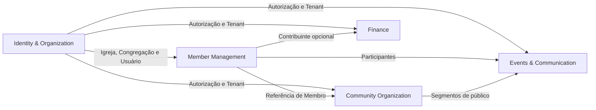
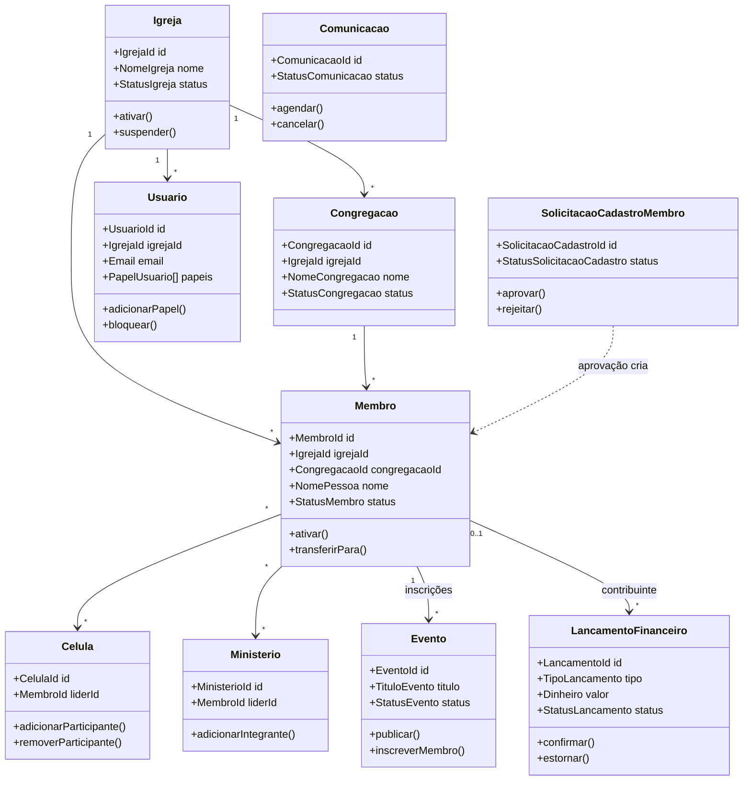

# Modelagem de Domínio — SaaS de Gestão de Igrejas

## 1. Visão geral do domínio

O sistema será um SaaS multi-tenant para automatizar processos administrativos de igrejas.

Cada igreja será representada no sistema por uma organização isolada, chamada neste documento de **Tenant** ou **Igreja**. Uma igreja poderá possuir uma ou várias congregações e diferentes usuários administrativos.

### Módulos do MVP

1. Organizações, congregações e controle de acesso.
2. Membros e autocadastro.
3. Células e ministérios.
4. Eventos e comunicação.
5. Financeiro e contribuições.

---

# 2. Linguagem ubíqua

Antes de criar classes e tabelas, é importante definir os termos utilizados pelo negócio.

| Termo                 | Significado                                                                 |
| --------------------- | --------------------------------------------------------------------------- |
| Igreja                | Organização contratante do SaaS e unidade principal de isolamento dos dados |
| Congregação           | Unidade física ou organizacional pertencente a uma igreja                   |
| Usuário               | Pessoa que possui credenciais para acessar o sistema                        |
| Membro                | Pessoa vinculada à comunidade da igreja                                     |
| Cadastro pendente     | Solicitação de entrada feita por um membro através de link público          |
| Administrador         | Usuário com controle administrativo amplo sobre a igreja                    |
| Pastor                | Usuário responsável por atividades pastorais e administrativas              |
| Secretário            | Usuário responsável por cadastros e rotinas administrativas                 |
| Líder                 | Pessoa responsável por uma célula ou ministério                             |
| Célula                | Pequeno grupo de membros que se reúne periodicamente                        |
| Ministério            | Grupo responsável por determinada área de atuação da igreja                 |
| Evento                | Atividade organizada pela igreja ou congregação                             |
| Inscrição             | Manifestação de participação de um membro em um evento                      |
| Comunicação           | Mensagem enviada para determinado público da igreja                         |
| Contribuição          | Entrada financeira realizada por um membro ou visitante                     |
| Categoria financeira  | Classificação de uma entrada ou saída financeira                            |
| Lançamento financeiro | Registro de movimentação de entrada ou saída                                |
| Competência           | Período contábil ao qual o lançamento pertence                              |
| Aprovação             | Decisão administrativa sobre um cadastro pendente                           |

Essa linguagem deve aparecer de maneira consistente:

* no código;
* nas histórias de usuário;
* nas APIs;
* no banco de dados;
* nos documentos;
* nas telas;
* nos testes.

Por exemplo, não utilizar simultaneamente `ChurchMember`, `Person`, `Participant` e `User` para representar o mesmo conceito. Cada termo deve possuir um significado específico.

---

# 3. Bounded Contexts do MVP

O domínio pode ser dividido nos seguintes bounded contexts:

```text
┌───────────────────────────────────────────────────────┐
│                 Identity & Organization               │
│ Igreja, Congregação, Usuário, Perfis e Permissões     │
└───────────────────────────────────────────────────────┘
                         │
                         ▼
┌───────────────────────────────────────────────────────┐
│                  Member Management                    │
│ Membro, Autocadastro, Aprovação e Vínculos            │
└───────────────────────────────────────────────────────┘
             │                             │
             ▼                             ▼
┌─────────────────────────────┐ ┌─────────────────────────────┐
│ Community Organization      │ │ Events & Communication      │
│ Células e Ministérios       │ │ Eventos, Inscrições, Avisos │
└─────────────────────────────┘ └─────────────────────────────┘
             │                             │
             └──────────────┬──────────────┘
                            ▼
┌───────────────────────────────────────────────────────┐
│                     Finance                           │
│ Contribuições, Entradas, Saídas e Categorias          │
└───────────────────────────────────────────────────────┘
```

## Por que separar em bounded contexts?

Cada contexto possui regras, conceitos e ciclos de vida diferentes.

Por exemplo:

* em **Identity**, uma pessoa é um usuário autenticado;
* em **Member Management**, essa pessoa é um membro da igreja;
* em **Finance**, essa pessoa pode ser apenas o contribuinte de uma oferta;
* em **Events**, ela pode ser uma participante inscrita.

Embora possam representar a mesma pessoa real, cada contexto enxerga apenas as informações necessárias para sua responsabilidade.

---

# 4. Contexto: Identity & Organization

## 4.1 Responsabilidade

Esse contexto controla:

* igrejas;
* congregações;
* usuários;
* autenticação;
* perfis;
* permissões;
* isolamento dos dados entre igrejas;
* vínculo dos usuários com uma igreja.

---

## 4.2 Agregado Igreja

A entidade `Igreja` é a raiz do agregado organizacional.

```text
Igreja
├── id
├── nome
├── nomeFantasia
├── documento
├── email
├── telefone
├── endereço
├── status
├── plano
├── configurações
└── congregações
```

### Entidade raiz: Igreja

```typescript
class Igreja {
  id: IgrejaId;
  nome: NomeIgreja;
  documento?: Documento;
  email: Email;
  telefone?: Telefone;
  endereco?: Endereco;
  status: StatusIgreja;
  plano: PlanoContratado;
  configuracoes: ConfiguracoesIgreja;
}
```

### Comportamentos

```typescript
igreja.ativar();
igreja.suspender();
igreja.alterarDadosInstitucionais(...);
igreja.alterarConfiguracoes(...);
igreja.adicionarCongregacao(...);
```

### Invariantes

1. Uma igreja deve possuir um nome.
2. O documento da igreja, quando informado, deve ser válido.
3. Uma igreja suspensa não pode permitir novas operações administrativas.
4. Todos os dados pertencentes à igreja devem carregar o seu `IgrejaId`.
5. Uma congregação não pode pertencer a duas igrejas.

---

## 4.3 Agregado Congregação

Dependendo da complexidade, `Congregação` pode começar como entidade do agregado `Igreja`. Entretanto, como congregações poderão possuir muitos membros, eventos, células e lançamentos, é mais seguro torná-la uma raiz de agregado independente.

```typescript
class Congregacao {
  id: CongregacaoId;
  igrejaId: IgrejaId;
  nome: NomeCongregacao;
  endereco?: Endereco;
  pastorResponsavelId?: MembroId;
  status: StatusCongregacao;
}
```

### Comportamentos

```typescript
congregacao.ativar();
congregacao.inativar();
congregacao.definirPastorResponsavel(membroId);
congregacao.alterarEndereco(endereco);
```

### Invariantes

1. Toda congregação pertence a exatamente uma igreja.
2. Uma congregação inativa não pode receber novos membros.
3. O pastor responsável deve pertencer à mesma igreja.
4. O nome da congregação deve ser único dentro da igreja, caso essa seja uma regra comercial adotada.

---

## 4.4 Agregado Usuário

O `Usuario` representa quem pode autenticar-se e operar o sistema.

```typescript
class Usuario {
  id: UsuarioId;
  igrejaId: IgrejaId;
  membroId?: MembroId;
  nome: NomePessoa;
  email: Email;
  credencial: Credencial;
  status: StatusUsuario;
  papeis: PapelUsuario[];
}
```

### Possíveis papéis

```typescript
enum PapelUsuario {
  ADMINISTRADOR = "ADMINISTRADOR",
  PASTOR = "PASTOR",
  SECRETARIO = "SECRETARIO",
  LIDER = "LIDER",
  FINANCEIRO = "FINANCEIRO",
  MEMBRO = "MEMBRO"
}
```

Um usuário pode possuir mais de um papel:

```text
João
├── PASTOR
└── ADMINISTRADOR
```

### Comportamentos

```typescript
usuario.ativar();
usuario.bloquear();
usuario.adicionarPapel(papel);
usuario.removerPapel(papel);
usuario.vincularMembro(membroId);
```

### Invariantes

1. O e-mail deve ser único para autenticação.
2. Um usuário bloqueado não pode autenticar-se.
3. Um papel não pode ser adicionado duas vezes.
4. O usuário somente pode acessar dados da igreja à qual pertence.
5. O usuário vinculado a um membro deve pertencer à mesma igreja que esse membro.

---

## 4.5 Value Objects do contexto

### IgrejaId

```typescript
class IgrejaId {
  constructor(readonly value: string) {
    if (!isValidUuid(value)) {
      throw new InvalidIgrejaIdError();
    }
  }
}
```

### Email

```typescript
class Email {
  constructor(readonly value: string) {
    const normalized = value.trim().toLowerCase();

    if (!isValidEmail(normalized)) {
      throw new InvalidEmailError();
    }

    this.value = normalized;
  }
}
```

### Endereço

```typescript
class Endereco {
  constructor(
    readonly logradouro: string,
    readonly numero: string,
    readonly complemento: string | null,
    readonly bairro: string,
    readonly cidade: string,
    readonly estado: string,
    readonly cep: string
  ) {}
}
```

### Permissão

Uma permissão representa uma operação específica:

```text
MEMBRO_CRIAR
MEMBRO_APROVAR
MEMBRO_EDITAR
MEMBRO_VISUALIZAR

EVENTO_CRIAR
EVENTO_EDITAR
EVENTO_PUBLICAR

FINANCEIRO_VISUALIZAR
FINANCEIRO_LANCAR
FINANCEIRO_ESTORNAR
```

Os papéis podem agrupar permissões:

```text
SECRETARIO
├── MEMBRO_CRIAR
├── MEMBRO_APROVAR
├── MEMBRO_EDITAR
├── EVENTO_CRIAR
└── EVENTO_EDITAR
```

---

# 5. Contexto: Member Management

## 5.1 Responsabilidade

Esse contexto controla:

* cadastro de membros;
* dados pessoais;
* situação do membro;
* autocadastro;
* aprovação administrativa;
* histórico de mudança de status;
* vínculo com congregações;
* classificação do membro.

---

## 5.2 Diferença entre Pessoa, Membro e Usuário

Esses conceitos não devem ser tratados como sinônimos.

### Pessoa

Representa dados pessoais básicos. Pode existir apenas conceitualmente ou como estrutura interna.

### Membro

Representa alguém que faz parte da comunidade da igreja.

### Usuário

Representa alguém que possui acesso autenticado ao sistema.

Exemplos:

```text
Membro sem usuário:
Maria frequenta a igreja, mas não acessa o sistema.

Usuário associado a membro:
João é pastor, membro da igreja e acessa o painel administrativo.

Usuário ainda não vinculado a membro:
Uma conta administrativa criada durante a implantação do sistema.
```

---

## 5.3 Agregado Membro

```typescript
class Membro {
  id: MembroId;
  igrejaId: IgrejaId;
  congregacaoId: CongregacaoId;
  nome: NomePessoa;
  dataNascimento?: DataNascimento;
  genero?: Genero;
  estadoCivil?: EstadoCivil;
  documento?: Documento;
  email?: Email;
  telefone?: Telefone;
  endereco?: Endereco;
  status: StatusMembro;
  dataEntrada: Date;
  dataBatismo?: Date;
  observacoes?: ObservacaoPastoral;
}
```

### Status possíveis

```typescript
enum StatusMembro {
  ATIVO = "ATIVO",
  INATIVO = "INATIVO",
  TRANSFERIDO = "TRANSFERIDO",
  AFASTADO = "AFASTADO",
  FALECIDO = "FALECIDO"
}
```

### Comportamentos

```typescript
membro.ativar();
membro.inativar(motivo);
membro.transferirPara(congregacaoId);
membro.registrarBatismo(data);
membro.atualizarContato(email, telefone);
membro.atualizarEndereco(endereco);
```

### Invariantes

1. Todo membro deve pertencer a uma igreja.
2. Um membro ativo deve estar associado a uma congregação ativa.
3. Um membro não pode ser transferido para uma congregação de outra igreja.
4. A data de batismo não pode estar no futuro.
5. A data de nascimento não pode estar no futuro.
6. Um membro falecido não pode retornar diretamente para ativo.
7. Alterações sensíveis devem ser auditadas.
8. O documento, quando informado, deve ser único dentro da igreja.

---

## 5.4 Agregado Solicitação de Cadastro

O autocadastro público não deve criar diretamente um membro ativo.

Ele deve gerar uma `SolicitacaoCadastroMembro`.

```typescript
class SolicitacaoCadastroMembro {
  id: SolicitacaoCadastroId;
  igrejaId: IgrejaId;
  congregacaoPretendidaId?: CongregacaoId;
  nome: NomePessoa;
  email?: Email;
  telefone: Telefone;
  dataNascimento?: DataNascimento;
  endereco?: Endereco;
  status: StatusSolicitacaoCadastro;
  tokenOrigem: TokenCadastroPublico;
  enviadaEm: Date;
  analisadaEm?: Date;
  analisadaPor?: UsuarioId;
  motivoRejeicao?: MotivoRejeicao;
}
```

### Status

```typescript
enum StatusSolicitacaoCadastro {
  PENDENTE = "PENDENTE",
  APROVADA = "APROVADA",
  REJEITADA = "REJEITADA",
  EXPIRADA = "EXPIRADA",
  CANCELADA = "CANCELADA"
}
```

### Comportamentos

```typescript
solicitacao.aprovar(usuarioId);
solicitacao.rejeitar(usuarioId, motivo);
solicitacao.expirar();
solicitacao.cancelar();
```

### Invariantes

1. Somente solicitações pendentes podem ser aprovadas ou rejeitadas.
2. Uma solicitação aprovada não pode ser aprovada novamente.
3. A aprovação deve registrar o usuário responsável.
4. Apenas administrador, pastor ou secretário autorizado pode aprovar.
5. Uma solicitação rejeitada deve possuir um motivo.
6. O token público deve estar ativo e pertencer à mesma igreja.
7. A aprovação deve criar um membro na igreja correspondente.
8. A solicitação e o membro criado devem manter um vínculo de rastreabilidade.

---

## 5.5 Agregado Link de Cadastro Público

```typescript
class LinkCadastroPublico {
  id: LinkCadastroId;
  igrejaId: IgrejaId;
  congregacaoId?: CongregacaoId;
  token: TokenCadastroPublico;
  ativo: boolean;
  expiraEm?: Date;
  limiteUtilizacoes?: number;
  quantidadeUtilizacoes: number;
}
```

### Comportamentos

```typescript
link.ativar();
link.desativar();
link.registrarUtilizacao();
link.definirExpiracao(data);
```

### Invariantes

1. Um link expirado não pode aceitar cadastros.
2. Um link desativado não pode aceitar cadastros.
3. O limite de utilizações não pode ser ultrapassado.
4. Links específicos de congregação devem cadastrar solicitações para a mesma congregação.
5. O token não deve expor IDs internos ou dados previsíveis.

---

## 5.6 Fluxo de autocadastro

```text
1. Administrador cria um link público
             │
             ▼
2. Interessado acessa o formulário
             │
             ▼
3. Interessado informa seus dados
             │
             ▼
4. Sistema valida o link e os dados
             │
             ▼
5. Solicitação de cadastro é criada como PENDENTE
             │
             ▼
6. Pastor, secretário ou administrador analisa
       ┌─────┴─────┐
       ▼           ▼
   APROVAR      REJEITAR
       │           │
       ▼           ▼
 Membro criado  Motivo registrado
 como ATIVO     e solicitante avisado
```

### Serviço de domínio para aprovação

A aprovação envolve dois agregados:

* `SolicitacaoCadastroMembro`;
* `Membro`.

Por isso, pode ser coordenada por um serviço de aplicação ou serviço de domínio.

```typescript
class AprovarSolicitacaoCadastroService {
  async execute(command: AprovarSolicitacaoCommand): Promise<MembroId> {
    const solicitacao = await solicitacaoRepository.findById(
      command.solicitacaoId
    );

    const aprovador = await usuarioRepository.findById(
      command.usuarioAprovadorId
    );

    autorizacaoService.validarPermissao(
      aprovador,
      "MEMBRO_APROVAR"
    );

    solicitacao.aprovar(aprovador.id);

    const membro = Membro.criarAPartirDaSolicitacao(solicitacao);

    await unitOfWork.execute(async () => {
      await membroRepository.save(membro);
      await solicitacaoRepository.save(solicitacao);
    });

    return membro.id;
  }
}
```

---

# 6. Contexto: Community Organization

Esse contexto controla células e ministérios.

Embora ambos sejam grupos de pessoas, possuem objetivos e regras diferentes.

* Célula: grupo de comunhão e acompanhamento.
* Ministério: grupo funcional de serviço.

Eles podem compartilhar conceitos, mas não precisam utilizar obrigatoriamente o mesmo agregado.

---

# 7. Agregado Célula

```typescript
class Celula {
  id: CelulaId;
  igrejaId: IgrejaId;
  congregacaoId: CongregacaoId;
  nome: NomeGrupo;
  descricao?: string;
  liderId: MembroId;
  viceLiderId?: MembroId;
  anfitriaoId?: MembroId;
  enderecoReuniao?: Endereco;
  diaSemana?: DiaSemana;
  horario?: Horario;
  status: StatusCelula;
  participantes: ParticipanteCelula[];
}
```

## Entidade ParticipanteCelula

```typescript
class ParticipanteCelula {
  membroId: MembroId;
  funcao: FuncaoNaCelula;
  entrouEm: Date;
  saiuEm?: Date;
  ativo: boolean;
}
```

### Funções possíveis

```typescript
enum FuncaoNaCelula {
  LIDER = "LIDER",
  VICE_LIDER = "VICE_LIDER",
  ANFITRIAO = "ANFITRIAO",
  PARTICIPANTE = "PARTICIPANTE"
}
```

### Comportamentos

```typescript
celula.definirLider(membroId);
celula.definirViceLider(membroId);
celula.adicionarParticipante(membroId);
celula.removerParticipante(membroId);
celula.alterarLocalReuniao(endereco);
celula.inativar();
```

### Invariantes

1. Toda célula deve possuir um líder.
2. O líder deve ser membro ativo da mesma igreja.
3. Um membro não pode ser adicionado duas vezes como participante ativo.
4. Uma célula inativa não pode receber novos participantes.
5. Todos os participantes devem pertencer à mesma igreja.
6. Caso a igreja determine, os participantes devem pertencer à mesma congregação.
7. O líder também deve constar na composição da célula.

---

# 8. Agregado Ministério

```typescript
class Ministerio {
  id: MinisterioId;
  igrejaId: IgrejaId;
  congregacaoId?: CongregacaoId;
  nome: NomeGrupo;
  descricao?: string;
  liderId: MembroId;
  status: StatusMinisterio;
  integrantes: IntegranteMinisterio[];
}
```

## Entidade IntegranteMinisterio

```typescript
class IntegranteMinisterio {
  membroId: MembroId;
  funcao: string;
  entrouEm: Date;
  saiuEm?: Date;
  ativo: boolean;
}
```

### Exemplos de ministérios

* Louvor;
* Infantil;
* Diaconia;
* Recepção;
* Missões;
* Comunicação;
* Ação social;
* Intercessão.

### Comportamentos

```typescript
ministerio.definirLider(membroId);
ministerio.adicionarIntegrante(membroId, funcao);
ministerio.removerIntegrante(membroId);
ministerio.alterarFuncao(membroId, novaFuncao);
ministerio.inativar();
```

### Invariantes

1. Todo ministério deve possuir um líder.
2. O líder deve ser membro ativo.
3. Um membro não pode ocupar a mesma função ativa duas vezes.
4. Um ministério inativo não pode receber novos integrantes.
5. O integrante deve pertencer à mesma igreja.
6. Ministérios vinculados a uma congregação somente podem receber membros permitidos pela política da igreja.

---

# 9. Contexto: Events & Communication

## 9.1 Responsabilidade

Esse contexto controla:

* criação de eventos;
* publicação;
* inscrições;
* limite de vagas;
* público-alvo;
* comunicações e avisos;
* segmentação dos destinatários.

---

# 10. Agregado Evento

```typescript
class Evento {
  id: EventoId;
  igrejaId: IgrejaId;
  congregacaoId?: CongregacaoId;
  titulo: TituloEvento;
  descricao?: string;
  local: LocalEvento;
  periodo: PeriodoEvento;
  capacidade?: Capacidade;
  publicoAlvo: PublicoAlvo;
  exigeInscricao: boolean;
  status: StatusEvento;
  inscricoes: InscricaoEvento[];
}
```

## Status do evento

```typescript
enum StatusEvento {
  RASCUNHO = "RASCUNHO",
  PUBLICADO = "PUBLICADO",
  CANCELADO = "CANCELADO",
  ENCERRADO = "ENCERRADO"
}
```

## Entidade InscricaoEvento

```typescript
class InscricaoEvento {
  id: InscricaoId;
  membroId?: MembroId;
  participanteExterno?: ParticipanteExterno;
  status: StatusInscricao;
  inscritoEm: Date;
  canceladoEm?: Date;
}
```

### Status da inscrição

```typescript
enum StatusInscricao {
  CONFIRMADA = "CONFIRMADA",
  CANCELADA = "CANCELADA",
  LISTA_ESPERA = "LISTA_ESPERA"
}
```

### Comportamentos

```typescript
evento.publicar();
evento.cancelar(motivo);
evento.encerrar();
evento.inscreverMembro(membroId);
evento.inscreverVisitante(participante);
evento.cancelarInscricao(inscricaoId);
```

### Invariantes

1. Um evento deve possuir título, data inicial e local.
2. A data final não pode ser anterior à data inicial.
3. Somente eventos publicados podem receber inscrições.
4. Eventos cancelados não podem receber inscrições.
5. Um membro não pode possuir duas inscrições ativas no mesmo evento.
6. Quando a capacidade for atingida, a nova inscrição deve ser recusada ou enviada para a lista de espera.
7. Um evento encerrado não pode ser editado livremente.
8. Um evento deve pertencer a uma igreja.
9. Um evento de congregação deve pertencer a uma congregação da mesma igreja.

---

## 10.1 Value Objects do evento

### Período do evento

```typescript
class PeriodoEvento {
  constructor(
    readonly inicio: Date,
    readonly fim: Date
  ) {
    if (fim < inicio) {
      throw new PeriodoEventoInvalidoError();
    }
  }

  estaEmAndamento(agora: Date): boolean {
    return agora >= this.inicio && agora <= this.fim;
  }
}
```

### Capacidade

```typescript
class Capacidade {
  constructor(readonly quantidade: number) {
    if (!Number.isInteger(quantidade) || quantidade <= 0) {
      throw new CapacidadeInvalidaError();
    }
  }
}
```

### Público-alvo

```typescript
type PublicoAlvo =
  | { tipo: "TODOS_MEMBROS" }
  | { tipo: "CONGREGACAO"; congregacaoId: CongregacaoId }
  | { tipo: "CELULA"; celulaId: CelulaId }
  | { tipo: "MINISTERIO"; ministerioId: MinisterioId }
  | { tipo: "MEMBROS_ESPECIFICOS"; membroIds: MembroId[] }
  | { tipo: "PUBLICO_EXTERNO" };
```

---

# 11. Agregado Comunicação

```typescript
class Comunicacao {
  id: ComunicacaoId;
  igrejaId: IgrejaId;
  titulo: TituloComunicacao;
  mensagem: ConteudoMensagem;
  destinatarios: SegmentoDestinatarios;
  canais: CanalComunicacao[];
  status: StatusComunicacao;
  agendadaPara?: Date;
  criadaPor: UsuarioId;
  criadaEm: Date;
  enviadaEm?: Date;
}
```

## Canais

```typescript
enum CanalComunicacao {
  NOTIFICACAO_INTERNA = "NOTIFICACAO_INTERNA",
  EMAIL = "EMAIL",
  WHATSAPP = "WHATSAPP"
}
```

No MVP, é possível começar apenas com:

* notificações internas;
* e-mail.

WhatsApp pode ser modelado, mas sua implementação pode ficar para uma evolução, pois depende de provedor externo e custos.

## Status

```typescript
enum StatusComunicacao {
  RASCUNHO = "RASCUNHO",
  AGENDADA = "AGENDADA",
  EM_PROCESSAMENTO = "EM_PROCESSAMENTO",
  ENVIADA = "ENVIADA",
  PARCIALMENTE_ENVIADA = "PARCIALMENTE_ENVIADA",
  FALHOU = "FALHOU",
  CANCELADA = "CANCELADA"
}
```

### Comportamentos

```typescript
comunicacao.agendar(data);
comunicacao.cancelar();
comunicacao.iniciarEnvio();
comunicacao.marcarComoEnviada();
comunicacao.marcarComoFalha();
```

### Invariantes

1. Uma comunicação deve possuir mensagem e destinatários.
2. Uma comunicação enviada não pode ser alterada.
3. O agendamento deve estar no futuro.
4. Uma comunicação cancelada não pode ser enviada.
5. O usuário criador deve possuir permissão de comunicação.
6. Os destinatários devem pertencer à mesma igreja.
7. Dados sensíveis não devem ser expostos entre destinatários.

---

# 12. Contexto: Finance

## 12.1 Responsabilidade

Esse contexto controla:

* contribuições;
* dízimos;
* ofertas;
* receitas;
* despesas;
* categorias financeiras;
* contas;
* formas de pagamento;
* relatórios básicos;
* estornos;
* conciliação manual simplificada.

O MVP não deve ser tratado como sistema contábil completo. Ele será inicialmente um sistema de gestão financeira administrativa.

---

# 13. Agregado Lançamento Financeiro

```typescript
class LancamentoFinanceiro {
  id: LancamentoId;
  igrejaId: IgrejaId;
  congregacaoId?: CongregacaoId;
  tipo: TipoLancamento;
  descricao: DescricaoLancamento;
  valor: Dinheiro;
  categoriaId: CategoriaFinanceiraId;
  contaFinanceiraId: ContaFinanceiraId;
  competencia: Competencia;
  dataMovimentacao: Date;
  formaPagamento?: FormaPagamento;
  contribuinteId?: MembroId;
  status: StatusLancamento;
  criadoPor: UsuarioId;
  criadoEm: Date;
  estorno?: Estorno;
}
```

## Tipo de lançamento

```typescript
enum TipoLancamento {
  ENTRADA = "ENTRADA",
  SAIDA = "SAIDA"
}
```

## Status

```typescript
enum StatusLancamento {
  PENDENTE = "PENDENTE",
  CONFIRMADO = "CONFIRMADO",
  CANCELADO = "CANCELADO",
  ESTORNADO = "ESTORNADO"
}
```

### Comportamentos

```typescript
lancamento.confirmar();
lancamento.cancelar(motivo);
lancamento.estornar(usuarioId, motivo, data);
lancamento.alterarCategoria(categoriaId);
```

### Invariantes

1. O valor deve ser maior que zero.
2. Todo lançamento deve possuir uma categoria.
3. Todo lançamento deve pertencer a uma igreja.
4. Um lançamento confirmado não pode ser excluído fisicamente.
5. Um lançamento confirmado incorreto deve ser estornado.
6. Um lançamento não pode ser estornado duas vezes.
7. O usuário responsável deve possuir permissão financeira.
8. O contribuinte, quando informado, deve pertencer à mesma igreja.
9. Uma saída não deve ser classificada em categoria exclusiva de entrada.
10. Um lançamento estornado deve preservar os dados originais para auditoria.

---

# 14. Contribuição como especialização de entrada

No MVP, existem duas opções de modelagem.

## Opção A — Contribuição como agregado próprio

```typescript
class Contribuicao {
  id: ContribuicaoId;
  igrejaId: IgrejaId;
  membroId?: MembroId;
  tipo: TipoContribuicao;
  valor: Dinheiro;
  data: Date;
  formaPagamento: FormaPagamento;
  lancamentoFinanceiroId: LancamentoId;
}
```

## Opção B — Contribuição representada pelo próprio lançamento

```typescript
LancamentoFinanceiro {
  tipo: ENTRADA;
  categoria: DIZIMO | OFERTA | DOACAO | CAMPANHA;
  contribuinteId?: MembroId;
}
```

## Recomendação para o MVP

Utilizar a **Opção B**.

Uma contribuição pode ser representada como um lançamento de entrada com:

* categoria de contribuição;
* membro contribuinte opcional;
* forma de pagamento;
* data;
* valor.

Isso reduz a quantidade de agregados e evita duplicação de dados.

Uma entidade `Contribuicao` separada somente se torna necessária quando houver regras próprias, como:

* recorrência automática;
* integração com Pix;
* geração de cobranças;
* comprovantes;
* campanhas com metas;
* conciliação bancária;
* anonimização avançada;
* split de valores;
* estornos específicos do gateway.

---

# 15. Agregado Categoria Financeira

```typescript
class CategoriaFinanceira {
  id: CategoriaFinanceiraId;
  igrejaId: IgrejaId;
  nome: NomeCategoria;
  natureza: NaturezaCategoria;
  categoriaPaiId?: CategoriaFinanceiraId;
  status: StatusCategoria;
}
```

## Natureza

```typescript
enum NaturezaCategoria {
  ENTRADA = "ENTRADA",
  SAIDA = "SAIDA",
  AMBAS = "AMBAS"
}
```

### Exemplos

```text
Entradas
├── Dízimos
├── Ofertas
├── Doações
└── Campanhas

Saídas
├── Água
├── Energia
├── Aluguel
├── Manutenção
├── Ação social
└── Materiais
```

### Invariantes

1. O nome da categoria deve ser único dentro do mesmo nível e igreja.
2. Uma categoria em uso não deve ser excluída fisicamente.
3. Categorias de entrada não podem classificar saídas.
4. Categorias de saída não podem classificar entradas.
5. Uma categoria não pode ser filha dela mesma.
6. A hierarquia não pode possuir ciclos.

---

# 16. Agregado Conta Financeira

```typescript
class ContaFinanceira {
  id: ContaFinanceiraId;
  igrejaId: IgrejaId;
  nome: NomeConta;
  tipo: TipoConta;
  saldoInicial: Dinheiro;
  status: StatusConta;
}
```

## Tipos

```typescript
enum TipoConta {
  CAIXA = "CAIXA",
  CONTA_CORRENTE = "CONTA_CORRENTE",
  POUPANCA = "POUPANCA",
  CARTEIRA_DIGITAL = "CARTEIRA_DIGITAL"
}
```

### Invariantes

1. Uma conta pertence a exatamente uma igreja.
2. Contas inativas não devem receber novos lançamentos.
3. O saldo não deve ser armazenado como valor arbitrariamente editável.
4. O saldo deve ser calculado a partir dos lançamentos confirmados, somado ao saldo inicial.

```text
Saldo atual =
saldo inicial
+ entradas confirmadas
- saídas confirmadas
- efeitos dos estornos
```

---

# 17. Value Objects financeiros

## Dinheiro

Nunca utilizar `float` ou `double` para valores monetários.

```typescript
class Dinheiro {
  private constructor(
    readonly centavos: bigint,
    readonly moeda: "BRL"
  ) {}

  static deReais(valor: string): Dinheiro {
    return new Dinheiro(converterParaCentavos(valor), "BRL");
  }

  somar(outro: Dinheiro): Dinheiro {
    this.validarMesmaMoeda(outro);

    return new Dinheiro(
      this.centavos + outro.centavos,
      this.moeda
    );
  }

  subtrair(outro: Dinheiro): Dinheiro {
    this.validarMesmaMoeda(outro);

    return new Dinheiro(
      this.centavos - outro.centavos,
      this.moeda
    );
  }
}
```

Exemplo:

```text
R$ 150,75 = 15.075 centavos
```

No banco:

```sql
valor_centavos BIGINT NOT NULL
moeda VARCHAR(3) NOT NULL DEFAULT 'BRL'
```

## Competência

```typescript
class Competencia {
  constructor(
    readonly ano: number,
    readonly mes: number
  ) {
    if (mes < 1 || mes > 12) {
      throw new CompetenciaInvalidaError();
    }
  }
}
```

## Forma de pagamento

```typescript
enum FormaPagamento {
  DINHEIRO = "DINHEIRO",
  PIX = "PIX",
  CARTAO_CREDITO = "CARTAO_CREDITO",
  CARTAO_DEBITO = "CARTAO_DEBITO",
  TRANSFERENCIA = "TRANSFERENCIA",
  BOLETO = "BOLETO",
  OUTRO = "OUTRO"
}
```

---

# 18. Eventos de domínio

Eventos de domínio representam fatos relevantes que já aconteceram.

Devem ser escritos no passado.

## Identity & Organization

```text
IgrejaCriada
IgrejaSuspensa
CongregacaoCriada
UsuarioCriado
UsuarioBloqueado
PapelConcedidoAoUsuario
```

## Member Management

```text
SolicitacaoCadastroRecebida
SolicitacaoCadastroAprovada
SolicitacaoCadastroRejeitada
MembroCadastrado
MembroAtivado
MembroInativado
MembroTransferido
```

## Community Organization

```text
CelulaCriada
LiderDeCelulaDefinido
MembroAdicionadoACelula
MembroRemovidoDaCelula
MinisterioCriado
IntegranteAdicionadoAoMinisterio
```

## Events & Communication

```text
EventoCriado
EventoPublicado
EventoCancelado
MembroInscritoEmEvento
InscricaoCancelada
ComunicacaoAgendada
ComunicacaoEnviada
```

## Finance

```text
LancamentoFinanceiroCriado
LancamentoFinanceiroConfirmado
LancamentoFinanceiroEstornado
ContribuicaoRegistrada
```

---

# 19. Exemplo de reação a eventos

Quando uma solicitação é aprovada:

```text
SolicitacaoCadastroAprovada
              │
              ├── Cria o membro
              │
              ├── Registra auditoria
              │
              └── Envia comunicação de aprovação
```

Quando um evento é publicado:

```text
EventoPublicado
       │
       ├── Torna o evento visível
       ├── Gera notificações internas
       └── Agenda comunicação, caso configurada
```

Quando uma contribuição é registrada:

```text
ContribuicaoRegistrada
       │
       ├── Atualiza projeção financeira
       ├── Alimenta relatório mensal
       └── Registra auditoria
```

Os eventos não precisam obrigatoriamente utilizar Kafka ou RabbitMQ no MVP. Eles podem inicialmente ser processados na própria aplicação, com persistência de Outbox quando a confiabilidade assíncrona se tornar necessária.

---

# 20. Context Map

O mapa de relacionamentos entre os contextos pode ser representado assim:



## Natureza das integrações

### Identity → demais contextos

`Identity & Organization` é upstream, pois fornece:

* `IgrejaId`;
* `CongregacaoId`;
* `UsuarioId`;
* papéis;
* permissões.

### Member Management → Células, Eventos e Financeiro

`Member Management` fornece identificadores e informações mínimas dos membros.

Os demais contextos não devem acessar diretamente todas as tabelas de membros.

Por exemplo, o contexto financeiro pode armazenar:

```typescript
type ContribuinteReferencia = {
  membroId: MembroId;
};
```

Para relatórios, pode existir uma projeção de leitura:

```typescript
type ContribuinteView = {
  membroId: string;
  nome: string;
};
```

---

# 21. Diagrama conceitual de agregados



Esse diagrama é conceitual. Ele não deve ser transformado diretamente em tabelas sem considerar os limites dos agregados.

---

# 22. Limites transacionais

Uma das decisões mais importantes da modelagem é determinar o que precisa ser salvo de forma atômica.

## Dentro do mesmo agregado

As alterações podem ocorrer na mesma transação do agregado.

Exemplo:

```text
Adicionar participante à célula:
- carregar célula;
- validar duplicidade;
- adicionar participante;
- salvar célula.
```

## Entre agregados diferentes

Um serviço de aplicação coordena a operação.

Exemplo:

```text
Aprovar cadastro:
- carregar solicitação;
- verificar aprovador;
- criar membro;
- atualizar solicitação;
- salvar os dois agregados em uma transação.
```

## Operações assíncronas

Não precisam estar na mesma transação:

```text
Aprovar cadastro:
- criar membro;
- confirmar aprovação;
- publicar evento.

Posteriormente:
- enviar e-mail;
- enviar notificação;
- atualizar analytics.
```

O cadastro não deve falhar apenas porque o serviço de e-mail está indisponível.

---

# 23. Regras de multi-tenancy

Toda raiz de agregado deve possuir `igrejaId`, exceto quando o próprio agregado for `Igreja`.

Exemplo:

```typescript
interface TenantOwned {
  igrejaId: IgrejaId;
}
```

## Regra obrigatória de consulta

Todas as consultas devem incluir o tenant:

```sql
SELECT *
FROM membros
WHERE igreja_id = :igrejaId
  AND id = :membroId;
```

Nunca:

```sql
SELECT *
FROM membros
WHERE id = :membroId;
```

Mesmo utilizando UUID, o `igrejaId` continua obrigatório. O UUID reduz colisões, mas não garante isolamento lógico.

## Repositório tenant-aware

```typescript
interface MembroRepository {
  findById(
    igrejaId: IgrejaId,
    membroId: MembroId
  ): Promise<Membro | null>;

  save(membro: Membro): Promise<void>;
}
```

Outra opção é o tenant estar no contexto da requisição:

```typescript
interface TenantContext {
  igrejaId: IgrejaId;
  usuarioId: UsuarioId;
}
```

Por segurança, é recomendável que os repositórios recebam explicitamente o tenant ou utilizem uma abstração que torne impossível consultar sem ele.

---

# 24. Auditoria

As operações administrativas e financeiras precisam ser auditáveis.

## Entidade conceitual de auditoria

```typescript
class RegistroAuditoria {
  id: AuditoriaId;
  igrejaId: IgrejaId;
  usuarioId?: UsuarioId;
  acao: string;
  recurso: string;
  recursoId: string;
  dadosAnteriores?: object;
  dadosNovos?: object;
  ocorridoEm: Date;
  ip?: string;
}
```

## Operações prioritárias para auditoria

* aprovação ou rejeição de cadastro;
* alteração de dados de membro;
* concessão de permissões;
* criação e edição de lançamentos;
* cancelamento ou estorno financeiro;
* exportação de dados;
* exclusão ou anonimização de dados;
* alteração de configurações da igreja.

Auditoria não deve depender apenas de logs textuais. Ela deve gerar registros estruturados e pesquisáveis.

---

# 25. Políticas de autorização

A autorização deve considerar:

```text
Permissão efetiva =
papel do usuário
+ igreja do usuário
+ congregação permitida
+ escopo do recurso
+ estado atual do recurso
```

Exemplo:

```typescript
authorizationService.assertCanApproveMember({
  actor: usuario,
  request: solicitacao
});
```

A autorização não deve existir apenas no controller.

Inadequado:

```typescript
if (req.user.role === "ADMIN") {
  await memberRepository.approve(id);
}
```

Mais apropriado:

```typescript
const policy = memberApprovalPolicy.evaluate({
  actor,
  request
});

if (!policy.allowed) {
  throw new ForbiddenOperationError(policy.reason);
}
```

---

# 26. Casos de uso principais do MVP

## Organizações e acesso

```text
CriarIgreja
AtualizarIgreja
CriarCongregacao
AtualizarCongregacao
CriarUsuario
ConcederPapelAoUsuario
RevogarPapelDoUsuario
BloquearUsuario
```

## Membros

```text
CriarLinkCadastroPublico
DesativarLinkCadastroPublico
EnviarSolicitacaoCadastro
ListarSolicitacoesPendentes
AprovarSolicitacaoCadastro
RejeitarSolicitacaoCadastro
CadastrarMembroManualmente
AtualizarMembro
TransferirMembro
InativarMembro
ConsultarMembro
ListarMembros
```

## Células

```text
CriarCelula
AtualizarCelula
DefinirLiderDaCelula
AdicionarParticipanteACelula
RemoverParticipanteDaCelula
InativarCelula
ListarCelulas
```

## Ministérios

```text
CriarMinisterio
AtualizarMinisterio
DefinirLiderDoMinisterio
AdicionarIntegranteAoMinisterio
RemoverIntegranteDoMinisterio
InativarMinisterio
```

## Eventos

```text
CriarEvento
AtualizarEvento
PublicarEvento
CancelarEvento
InscreverMembroNoEvento
InscreverVisitanteNoEvento
CancelarInscricao
ListarEventos
```

## Comunicação

```text
CriarComunicacao
AgendarComunicacao
CancelarComunicacao
EnviarComunicacao
ConsultarHistoricoDeEnvios
```

## Financeiro

```text
CriarCategoriaFinanceira
CriarContaFinanceira
RegistrarEntrada
RegistrarContribuicao
RegistrarSaida
ConfirmarLancamento
CancelarLancamento
EstornarLancamento
ConsultarFluxoFinanceiro
ConsultarResumoMensal
```

---

# 27. Exemplo completo de caso de uso

## Registrar contribuição

### Command

```typescript
type RegistrarContribuicaoCommand = {
  igrejaId: string;
  congregacaoId?: string;
  contribuinteId?: string;
  valor: string;
  categoriaId: string;
  contaFinanceiraId: string;
  formaPagamento: FormaPagamento;
  dataMovimentacao: Date;
  competencia: {
    mes: number;
    ano: number;
  };
  usuarioResponsavelId: string;
};
```

### Serviço de aplicação

```typescript
class RegistrarContribuicaoUseCase {
  constructor(
    private readonly membroRepository: MembroRepository,
    private readonly categoriaRepository: CategoriaFinanceiraRepository,
    private readonly contaRepository: ContaFinanceiraRepository,
    private readonly lancamentoRepository: LancamentoRepository,
    private readonly authorizationService: AuthorizationService
  ) {}

  async execute(
    command: RegistrarContribuicaoCommand
  ): Promise<LancamentoId> {
    await this.authorizationService.assertPermission(
      command.usuarioResponsavelId,
      command.igrejaId,
      "FINANCEIRO_LANCAR"
    );

    if (command.contribuinteId) {
      const membro = await this.membroRepository.findById(
        new IgrejaId(command.igrejaId),
        new MembroId(command.contribuinteId)
      );

      if (!membro) {
        throw new MembroNaoEncontradoError();
      }
    }

    const categoria = await this.categoriaRepository.findById(
      new IgrejaId(command.igrejaId),
      new CategoriaFinanceiraId(command.categoriaId)
    );

    if (!categoria?.aceitaEntrada()) {
      throw new CategoriaNaoAceitaEntradaError();
    }

    const conta = await this.contaRepository.findById(
      new IgrejaId(command.igrejaId),
      new ContaFinanceiraId(command.contaFinanceiraId)
    );

    if (!conta?.estaAtiva()) {
      throw new ContaFinanceiraInativaError();
    }

    const lancamento = LancamentoFinanceiro.registrarEntrada({
      igrejaId: new IgrejaId(command.igrejaId),
      congregacaoId: command.congregacaoId
        ? new CongregacaoId(command.congregacaoId)
        : undefined,
      contribuinteId: command.contribuinteId
        ? new MembroId(command.contribuinteId)
        : undefined,
      valor: Dinheiro.deReais(command.valor),
      categoriaId: categoria.id,
      contaFinanceiraId: conta.id,
      formaPagamento: command.formaPagamento,
      dataMovimentacao: command.dataMovimentacao,
      competencia: new Competencia(
        command.competencia.ano,
        command.competencia.mes
      ),
      criadoPor: new UsuarioId(command.usuarioResponsavelId)
    });

    await this.lancamentoRepository.save(lancamento);

    return lancamento.id;
  }
}
```

---

# 28. Estrutura de projeto sugerida

Para um monólito modular com TypeScript e NestJS:

```text
src/
├── modules/
│   ├── identity/
│   │   ├── domain/
│   │   │   ├── aggregates/
│   │   │   ├── entities/
│   │   │   ├── value-objects/
│   │   │   ├── events/
│   │   │   ├── policies/
│   │   │   └── repositories/
│   │   ├── application/
│   │   │   ├── use-cases/
│   │   │   ├── commands/
│   │   │   ├── queries/
│   │   │   └── dto/
│   │   ├── infrastructure/
│   │   │   ├── persistence/
│   │   │   ├── repositories/
│   │   │   └── authentication/
│   │   └── presentation/
│   │       └── http/
│   │
│   ├── members/
│   ├── community/
│   ├── events/
│   ├── communication/
│   └── finance/
│
├── shared/
│   ├── domain/
│   │   ├── entity.ts
│   │   ├── aggregate-root.ts
│   │   ├── domain-event.ts
│   │   └── result.ts
│   ├── infrastructure/
│   └── application/
│
└── main.ts
```

Cada módulo deve controlar suas próprias regras e interfaces de persistência.

Não é recomendável criar uma pasta global como:

```text
src/
├── controllers/
├── services/
├── entities/
└── repositories/
```

Essa organização agrupa elementos por tipo técnico, mas espalha o domínio por toda a aplicação.

---

# 29. Estratégia arquitetural recomendada

Para esse MVP, a melhor abordagem provavelmente é:

```text
Monólito modular
+ DDD estratégico
+ DDD tático nos agregados principais
+ Clean Architecture pragmática
+ banco PostgreSQL compartilhado
+ schemas ou prefixos por módulo
+ eventos de domínio internos
```

## Por que não iniciar com microsserviços?

Porque o produto ainda está validando:

* requisitos;
* limites dos contextos;
* regras;
* volume;
* padrões de uso;
* modelo comercial.

Microsserviços adicionariam:

* comunicação distribuída;
* observabilidade mais complexa;
* consistência eventual;
* contratos remotos;
* deployment independente;
* maior custo operacional;
* maior dificuldade de testes.

O monólito modular permite preservar os limites do domínio sem antecipar a complexidade de uma arquitetura distribuída.

---

# 30. Dependências permitidas entre módulos

Uma possível regra:

```text
identity
   ↑
members
   ↑
community
   ↑
events
```

Mas é melhor evitar dependências diretas excessivas.

Os módulos devem integrar-se por:

1. IDs;
2. interfaces de serviços;
3. eventos de domínio;
4. projeções de leitura;
5. contratos de aplicação.

Exemplo inadequado:

```typescript
import { MembroEntity } from "../../members/infrastructure/typeorm";
```

Exemplo mais adequado:

```typescript
interface MemberStatusChecker {
  isActive(
    igrejaId: IgrejaId,
    membroId: MembroId
  ): Promise<boolean>;
}
```

O contexto de células depende de um contrato, não da entidade ORM do módulo de membros.

---

# 31. O que deve ser entidade e o que deve ser Value Object

## Entidades

Possuem identidade e ciclo de vida próprio:

```text
Igreja
Congregação
Usuário
Membro
Solicitação de cadastro
Célula
Participante da célula
Ministério
Integrante do ministério
Evento
Inscrição
Comunicação
Lançamento financeiro
Categoria financeira
Conta financeira
```

## Value Objects

Representam valores definidos por seus atributos:

```text
Email
Telefone
Documento
Endereço
NomePessoa
Dinheiro
Competência
PeríodoEvento
Capacidade
MotivoRejeição
MotivoEstorno
TokenCadastroPublico
```

### Exemplo da diferença

Um `Membro` continua sendo o mesmo membro mesmo depois de mudar:

* telefone;
* e-mail;
* endereço;
* nome civil.

Por isso, é entidade.

Já dois objetos `Dinheiro` com valor de R$ 100,00 e moeda BRL representam o mesmo valor. Eles não precisam de identidade própria. Por isso, são Value Objects.

---

# 32. Agregados recomendados

| Agregado                | Raiz                      | Elementos internos                  |
| ----------------------- | ------------------------- | ----------------------------------- |
| Igreja                  | Igreja                    | Configurações institucionais        |
| Congregação             | Congregação               | Configurações locais                |
| Usuário                 | Usuário                   | Papéis do usuário                   |
| Membro                  | Membro                    | Dados pessoais e histórico imediato |
| Solicitação de cadastro | SolicitaçãoCadastroMembro | Dados submetidos e análise          |
| Link público            | LinkCadastroPublico       | Regras de validade e uso            |
| Célula                  | Célula                    | Participantes da célula             |
| Ministério              | Ministério                | Integrantes                         |
| Evento                  | Evento                    | Inscrições                          |
| Comunicação             | Comunicação               | Configuração de envio               |
| Lançamento financeiro   | LancamentoFinanceiro      | Informações de estorno              |
| Categoria financeira    | CategoriaFinanceira       | Hierarquia da categoria             |
| Conta financeira        | ContaFinanceira           | Configuração da conta               |

---

# 33. Decisões pragmáticas para o MVP

## Implementar agora

* isolamento por igreja;
* congregações;
* usuários e papéis;
* membros;
* autocadastro e aprovação;
* células;
* ministérios;
* eventos;
* inscrições;
* comunicações básicas;
* lançamentos financeiros;
* categorias;
* contas financeiras;
* contribuições;
* auditoria das operações críticas.

## Modelar, mas postergar implementação completa

* WhatsApp;
* notificações push;
* conciliação bancária;
* Pix automatizado;
* pagamentos recorrentes;
* emissão de recibos fiscais;
* contabilidade completa;
* aprovação financeira em múltiplas etapas;
* workflow pastoral;
* controle de presença em células;
* check-in em eventos;
* aplicativo mobile;
* dashboards analíticos avançados.

## Evitar no MVP

* microsserviços;
* event sourcing;
* CQRS completo para todos os módulos;
* múltiplos bancos por contexto;
* mecanismos genéricos demais;
* regras configuráveis excessivamente abstratas;
* integração direta entre entidades ORM de módulos diferentes.

---

# 34. Modelo de domínio resumido

```text
Igreja
├── possui Congregações
├── possui Usuários
├── possui Membros
├── possui Células
├── possui Ministérios
├── organiza Eventos
├── envia Comunicações
└── administra Finanças

Membro
├── pertence a uma Igreja
├── pertence a uma Congregação
├── pode participar de Células
├── pode integrar Ministérios
├── pode inscrever-se em Eventos
├── pode realizar Contribuições
└── pode possuir um Usuário

Autocadastro
├── ocorre por Link Público
├── cria Solicitação Pendente
├── exige análise autorizada
├── pode ser aprovado
│   └── cria Membro
└── pode ser rejeitado
    └── exige Motivo

Financeiro
├── possui Contas
├── possui Categorias
├── registra Entradas
├── registra Saídas
├── identifica Contribuintes opcionalmente
├── permite Confirmação
└── permite Estorno auditável
```

---

# 35. Recomendação final

A modelagem deve ser implementada inicialmente como um **monólito modular**, no qual cada bounded context é um módulo explicitamente isolado.

Os agregados mais importantes para receber regras de domínio desde o início são:

1. `SolicitacaoCadastroMembro`;
2. `Membro`;
3. `Celula`;
4. `Ministerio`;
5. `Evento`;
6. `LancamentoFinanceiro`;
7. `Usuario`.

A `IgrejaId` deve aparecer em praticamente todas as operações e estruturas persistidas, porque o isolamento multi-tenant é uma regra central do produto, e não apenas uma decisão técnica.

O principal fluxo vertical inicial recomendado é:

```text
Criar igreja
→ criar administrador
→ criar congregação
→ gerar link público
→ receber solicitação
→ aprovar solicitação
→ criar membro
→ adicionar membro a célula ou ministério
→ inscrever membro em evento
→ registrar contribuição
```

Esse fluxo exercita todos os principais limites do domínio e permite construir o MVP incrementalmente sem precisar implementar todos os módulos simultaneamente.